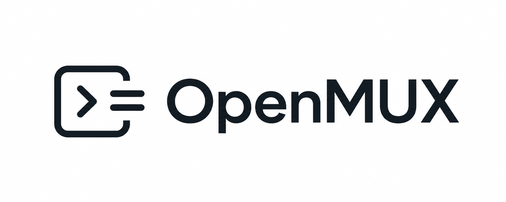

  

<h1 align="center">OpenMUX</h1>

  A fast, native, flexible, and hackable terminal workspace for developers.

  
  
  

  <a href="./docs/manifest.md">Manifesto</a>

---

## Why OpenMUX

OpenMUX exists to reclaim the terminal as a workspace that is fast, reliable, and open to change.

It is built for developers who want tools they can understand, adapt, script, and build on, without being forced into a single vendor, workflow, or bloated all-in-one platform.

## Principles

- **Open by design** — core behavior should be inspectable, replaceable, and extendable.
- **Native where it matters** — terminal input, focus, accessibility, windows, and notifications should feel at home on macOS.
- **Built on strong foundations** — use `libghostty` deliberately and keep it behind a narrow OpenMUX bridge.
- **Terminal first** — the terminal is the product, not a sidecar to something else.
- **Tools, not opinions** — OpenMUX should support shell users, tmux users, SSH-heavy workflows, and AI-assisted workflows equally well.
- **Hackability over features** — expose hooks and extension points instead of hardcoding every workflow into the core.
- **Sensible defaults** — useful tabs, session management, notifications, and keybindings should work out of the box.
- **International-first** — keyboard handling must work correctly across layouts, modifiers, and compose/dead key input.

## AI-Friendly by Design

OpenMUX is not an AI-first terminal, but it is intended to be **AI-friendly**.

That means building the project in ways that are easy for both humans and AI systems to work with:

- Clear contracts and explicit interfaces
- Strong typing over ambiguous behavior
- Open specifications and documented extension points
- Predictable structure instead of hidden magic

AI should integrate through the same open system as everything else: CLI commands, JSON-RPC, hooks, events, and external plugins.

The goal is not to turn the terminal into an agent product.
The goal is to make OpenMUX easy to understand, extend, and build on with good engineering discipline, without privileging one vendor or one agent.

## What OpenMUX is

OpenMUX is aiming to be a modern foundation for terminal workspaces:

- A **native macOS app** built AppKit-first, with SwiftUI used selectively where it helps
- Built on strong foundations with **libghostty** isolated behind a narrow bridge
- Designed around a **hookable core**
- Controlled through a local **`omux` + JSON-RPC** control plane
- Extended through **external plugins first**
- Focused on **performance as a feature**

## What OpenMUX is not

- Not an AI-first terminal
- Not a browser inside a terminal
- Not a vendor-specific workflow tool
- Not a monolithic "do everything" tool
- Not a web app wrapped as a desktop app
- Not tied to a single vendor or ecosystem
- Not a fork of cmux or Ghostty

## Architecture Direction

The architecture is intentionally small and composable. OpenMUX is designed around a few stable seams:

- **AppKit-first shell** for windows, panes, focus, keyboard handling, and native macOS behavior
- **Thin libghostty bridge** so higher-level product logic stays in OpenMUX-native concepts
- **Local-first control plane** via `omux` and JSON-RPC over a Unix domain socket
- **Hook and event system** for lifecycle, session, command, UI, and input behavior
- **External plugin processes first**, with richer runtimes possible later

Plugins are a primary extension model, not an afterthought. The protocol is the platform: tools, scripts, and agents should all be able to cooperate through the same open control surface.

## Vision

OpenMUX aims to become the standard foundation for modern terminal workspaces by staying:

- **Native**
- **Reliable**
- **Extensible**
- **Scriptable**

This is not positioned as a finished product. It is a foundation meant to be built on.

## Status

OpenMUX is in its early stage, and the current direction is defined in the [manifest](./docs/manifest.md).

## Development

The repository now includes an initial Swift package foundation for:

- a native **OpenMUXApp** macOS executable
- the **`omux`** CLI
- a narrow **terminal bridge** boundary
- a local **JSON-RPC** control plane
- external **hook execution** seams

See [docs/development.md](./docs/development.md) for module boundaries and foundation rules.

## Contributing

Please read [CONTRIBUTING](./CONTRIBUTING.md) and [CODE OF CONDUCT](./CODE_OF_CONDUCT.md) before opening a pull request.

## License

OpenMUX is released under **Apache-2.0**. See [LICENSE](./LICENSE).

---

<b>Made for developers who want the terminal to stay fast, flexible, and open.</b>

Made with ❤️ in Skåne. A <a href="https://fingergun.dev/">Finger Gun</a> project, making nothing into something.

