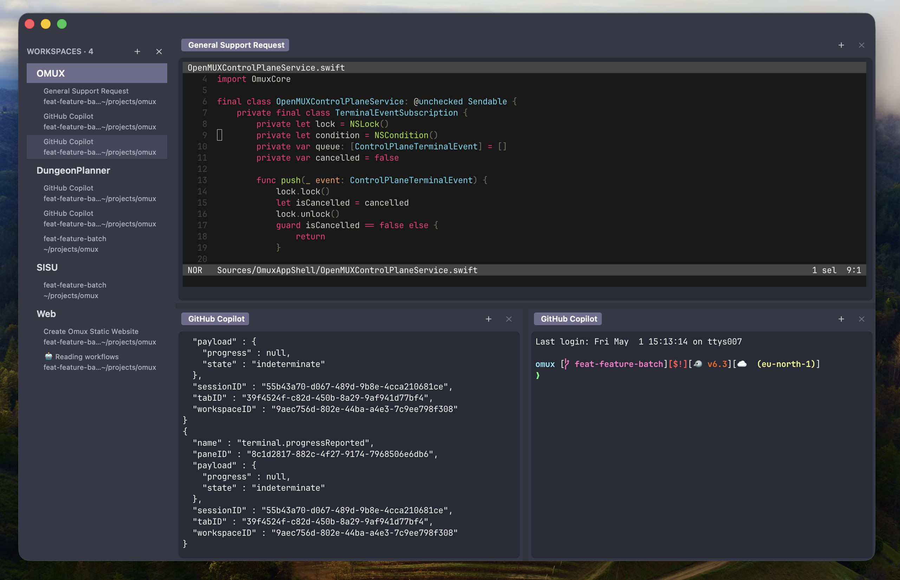

<p align="center">
  
</p>

<h1 align="center">OpenMUX</h1>

<p align="center">
  Native macOS terminal workspace for developers.
</p>

<p align="center">
  Fast, native, flexible, and hackable. Terminal-first, scriptable by default, and built to stay open to your workflow.
</p>

<p align="center">
  <span>
    <a href="https://github.com/finger-gun/omux/actions/workflows/ci.yml"></a>
    
    
    
    
  </span>
</p>

<p align="center">
  <a href="https://openmux.fingergun.dev/">Website</a>
  ·
  <a href="./docs/README.md">Docs</a>
  ·
  <a href="./docs/getting-started.md">Get Started</a>
  ·
  <a href="./docs/manifest.md">Manifesto</a>
  ·
  <a href="./docs/configuration.md">Configuration</a>
  ·
  <a href="./docs/hooks.md">Hooks</a>
  ·
  <a href="./docs/development.md">Development</a>
  ·
  <a href="./docs/releasing.md">Releases</a>
</p>

---



## Why OpenMUX

The terminal should be a workspace, not a locked box.

OpenMUX exists for developers who want native terminal workflows without giving up inspectability, scriptability, or control. It takes the opposite bet from bloated, vendor-shaped terminals: keep the core small, keep the seams visible, and let hooks, events, and commands do the heavy lifting.

## What OpenMUX can do today

OpenMUX is already a usable beta foundation with:

- native macOS shell chrome built AppKit-first
- workspaces, top-level tabs, split panes, and pane-local tab stacks
- persistent interactive shell sessions with direct typing, paste, resize, command injection, and bounded scrollback restore across app restarts
- a local `omux` CLI plus JSON-RPC control plane
- external hooks and a mixed local event stream via `omux events`
- token-based theme ownership with fuzzy-searchable built-in themes and user overrides
- required vendored Ghostty runtime hosting behind a narrow OpenMUX bridge
- explicit keyboard-correctness work for ISO layouts, Option behavior, dead keys, compose input, and IME-sensitive flows

## Start using OpenMUX

The user documentation starts at [docs/README.md](./docs/README.md), with a first-run guide in [docs/getting-started.md](./docs/getting-started.md).

Useful user references:

- [Getting started](./docs/getting-started.md) for install, first launch, the `omux` CLI, workspaces, panes, themes, and a first hook.
- [Configuration and themes](./docs/configuration.md) for `~/.omux/config.toml`, theme selection, custom tokens, and terminal settings.
- [Hooks](./docs/hooks.md) for executable user hooks in `~/.omux/hooks/`, invocation JSON, and automation examples.

## Workspace primitives

OpenMUX is built around durable primitives instead of one blessed workflow:

- **Workspaces** for project-level context
- **Tabs** for top-level workspace organization
- **Split panes** for side-by-side and stacked layouts
- **Pane-local tab stacks** for multiple sessions inside one split region
- **Persistent sessions** so UI actions and CLI automation target the same live shell
- **Hooks, events, and commands** as first-class extension seams

## `omux` and the local control plane

The CLI talks to the running app over a local JSON-RPC Unix socket boundary.

Small taste of what the CLI can do:

```bash
omux list
omux open [path]
omux split down
omux run <session-id> "pwd"
omux theme
omux history clear --focused
omux events
omux update
```

Use `omux help` for the command list, then jump into [Getting started](./docs/getting-started.md) and [Configuration and themes](./docs/configuration.md) for the practical walkthroughs.

## Architecture direction

OpenMUX keeps a narrow core with stable seams:

- **AppKit-first shell** for windows, focus, menus, notifications, and precision input behavior
- **Thin `libghostty` bridge** so higher-level product logic stays in OpenMUX-native concepts
- **Local-first control plane** through `omux` and JSON-RPC
- **Hooks and events** for lifecycle, session, command, UI, and future plugin automation
- **External plugin processes first** instead of hardwiring one workflow into the app

The product speaks in OpenMUX concepts: workspaces, tabs, panes, sessions, hooks, notifications, commands, and events.

## Configuration and themes

OpenMUX owns its user-facing configuration in `~/.omux/config.toml`, custom themes in `~/.omux/themes/`, generated Ghostty artifacts in `~/.omux/generated/ghostty/`, and local workspace/scrollback state under `~/Library/Application Support/OpenMUX/`.

Themes are OpenMUX-native tokens with built-in presets and user overrides. Run `omux theme` for the fuzzy-search picker, or use direct commands:

```bash
omux config init
omux config doctor
omux config reload
omux theme
omux theme list
omux theme nord
```

For the full built-in theme list, custom token format, terminal settings, persisted scrollback behavior, and keybinding model, see [Configuration and themes](./docs/configuration.md).

## Quick start for contributors

OpenMUX uses Swift Package Manager with a vendored Ghostty runtime path.

```bash
make setup
make dev
make test
make verify
swift run OpenMUXApp
```

If you want the current module boundaries, runtime build notes, and command list, see [docs/development.md](./docs/development.md).

## Releases and installation

OpenMUX has an early GitHub Release flow for downloadable macOS artifacts, packaged with:

- `make package-release`
- tag-driven GitHub Releases on `v*`
- unsigned macOS app and CLI archives plus checksums
- in-app background update checks when enabled, plus explicit CLI updates with `omux update`

The app bundle includes a bundled `omux` binary. You can install it from the app with **OpenMUX -> Install omux CLI**, or from Terminal with:

```bash
/Applications/OpenMUX.app/Contents/MacOS/omux install-cli
```

After that, `omux version` reports the installed version and `omux update` installs the latest verified GitHub Release.

For the exact packaging and release flow, see [docs/releasing.md](./docs/releasing.md).

## Status

OpenMUX is in **beta**.

The foundations are now in place:

1. Native app shell, workspace tabs, split panes, and pane-local tabs
2. `omux` CLI, JSON-RPC control plane, hooks, local events, and self-update plumbing
3. Required vendored Ghostty runtime path
4. Theme/config ownership in OpenMUX-native terms
5. Persisted workspace and bounded scrollback restore
6. CI and first-pass release automation

Current follow-on areas include transcript quality, layout restore polish, richer automation, and a broader plugin story.

## Project principles

OpenMUX is:

- **Open by design**
- **Terminal first**
- **Native where it matters**
- **Hackable over bloated**
- **AI-friendly, not AI-first**
- **International-first for keyboard correctness**

Read the full rationale in the [manifesto](./docs/manifest.md).

## Contributing

Please read [CONTRIBUTING](./CONTRIBUTING.md) and [CODE OF CONDUCT](./CODE_OF_CONDUCT.md) before opening a pull request.

## License

OpenMUX is released under **Apache-2.0**. See [LICENSE](./LICENSE).

---

<div align="center">

<b>Build your terminal workspace, not someone else's.</b>

<a href="https://openmux.fingergun.dev/">openmux.fingergun.dev</a> · Built with ❤️ in Skåne. A <a href="https://fingergun.dev/">Finger Gun</a> project.

</div>
