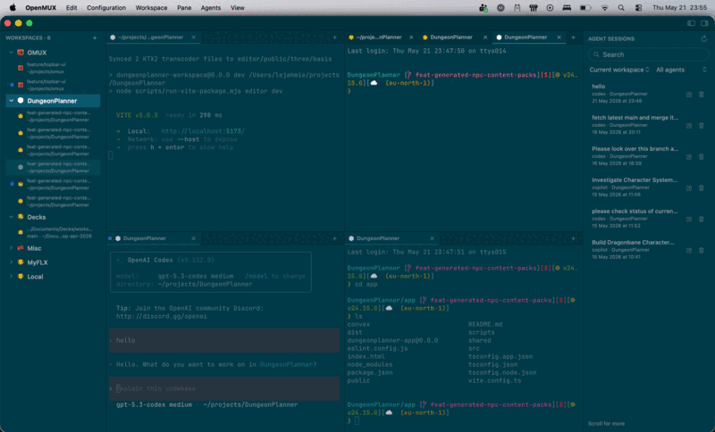

<p align="center">
  
</p>

<h1 align="center">OpenMUX</h1>

<p align="center">
  Native macOS terminal workspace for developers.
</p>

<p align="center">
 Fast, flexible, scriptable, and terminal-first.
</p>

<p align="center">
  <span>
    <a href="https://github.com/finger-gun/omux/actions/workflows/ci.yml"></a>
    <a href="https://github.com/finger-gun/omux/actions/workflows/ui-tests.yml"></a>
    
    
    
    
  </span>
</p>

<p align="center">
  <a href="https://openmux.fingergun.dev/">Website</a>
  ·
  <a href="./docs/README.md">Docs</a>
  ·
  <a href="./docs/getting-started.md">Get Started</a>
  ·
  <a href="./docs/configuration.md">Configuration</a>
  ·
  <a href="./docs/plugins/index.md">Plugins</a>
  ·
  <a href="./docs/developer.md">Development</a>
</p>

---



## What OpenMUX is

OpenMUX is a native macOS terminal workspace. It gives you workspaces, tabs, split panes, pane-local tab stacks, persistent shell sessions, themes, a local CLI, hooks, bundled plugins, registry-installed plugins, and extension panes.

The goal is simple: keep the terminal powerful, inspectable, and open to your workflow.

## What works today

OpenMUX is a beta, but the core workflow is usable:

- native AppKit shell with a terminal-first layout
- workspaces, top-level tabs, split panes, and pane-local tabs
- persistent shell sessions with direct typing, paste, drag-and-drop text/URLs/files, resize, command injection, isolated shell history, and bounded scrollback restore
- local `omux` CLI and JSON-RPC control plane
- external hook system, official hook registry, and `omux events`
- fuzzy-search theme picker and token-based themes
- command palette, focused-pane find, and keyboard-first pane/workspace actions
- Agent Sessions for local coding-agent history, including built-in Copilot/Codex/Gemini adapters and registry-hosted adapters such as OpenCode, KiloCode, and OMP
- Markdown Preview, plugin command discovery, extension panes, floating pane modals, native menu contributions, and the official plugin registry
- XCUIAutomation coverage for the native app shell in CI
- explicit keyboard-correctness work for ISO layouts, Option behavior, dead keys, compose input, and IME-sensitive flows

## Start here

Quick install from the latest GitHub Release:

```bash
curl -fsSL https://github.com/finger-gun/omux/releases/latest/download/openmux-install.sh | bash
```

This installs `OpenMUX.app` and links the bundled `omux` CLI at `~/.local/bin/omux`.

User docs:

- [Getting started](./docs/getting-started.md) - install, first launch, CLI setup, workspaces, panes, themes, hooks, plugins, and the release installer script.
- [Configuration and themes](./docs/configuration.md) - `~/.omux/config.toml`, themes, terminal settings, keybindings, and plugin config.
- [Agent Sessions](./docs/agent-sessions.md) - search, resume, monitor, and delete locally indexed coding-agent sessions from built-in and plugin-provided adapters.
- [Hooks](./docs/hooks.md) - executable user hooks, registry installs, hook payloads, and automation examples.
- [Plugins](./docs/plugins/index.md) - bundled plugins, registry installs, and plugin management.
- [Plugin ecosystem](./docs/plugins.md) - how to create external plugin commands, extension panes, and menu contributions.

Contributor docs:

- [Developer quick start](./docs/developer.md) - local setup, Makefile workflow, and validation commands.
- [Development notes](./docs/development.md) - module boundaries and runtime bridge details.
- [Releasing](./docs/releasing.md) - package and GitHub Release flow.
- [Manifesto](./docs/manifest.md) - product principles and architectural guardrails.

## Common user commands

If you installed the app without the CLI, link the bundled command from the app:

```bash
/Applications/OpenMUX.app/Contents/MacOS/omux install-cli
```

Then use it to control the running app:

```bash
omux help
omux open ~/projects/my-project
omux list --full
omux split right
omux run --focused -- "git status"
omux theme
omux agent-sessions open
omux plugins
omux events
```

The CLI talks to the running app over a local Unix socket. UI actions and CLI commands target the same live workspaces and shell sessions.

## Configuration

OpenMUX stores user configuration in:

```text
~/.omux/config.toml
```

Create a starter config:

```bash
omux config init
omux config doctor
omux config open
omux config reload
```

User-owned files live under `~/.omux/`:

| Path | Purpose |
| --- | --- |
| `~/.omux/config.toml` | User configuration. |
| `~/.omux/themes/` | Custom themes. |
| `~/.omux/hooks/` | User hook handlers. |
| `~/.omux/plugins/` | External plugin commands. |
| `~/.omux/installed/` | Receipts for registry-installed hooks and plugins. |
| `~/.omux/agent-sessions.sqlite` | Local Agent Sessions index. |
| `~/.omux/generated/ghostty/` | OpenMUX-managed generated terminal config. |

## Plugins

OpenMUX has two plugin and automation surfaces:

1. Bundled plugins, such as Markdown Preview and AI Status, can be toggled with `omux plugins`.
2. User plugins are executable commands discovered from `~/.omux/plugins/`.

Plugins can create extension panes with `omux extension-pane`, listen through hooks, call back into the public CLI, and contribute native menu items. Hooks are executable event handlers under `~/.omux/hooks/`.

Official registries:

| Registry | Repository |
| --- | --- |
| Hooks | <https://github.com/finger-gun/omux-hooks> |
| Plugins | <https://github.com/finger-gun/omux-plugins> |

Discover registry packages with `omux hooks discover` and `omux plugins discover`. See [Hooks](./docs/hooks.md) for the hook system, [Plugin ecosystem](./docs/plugins.md) for the plugin contract, and [Plugin index](./docs/plugins/index.md) for bundled and registry-hosted plugins.

Registry-hosted Agent Sessions plugins can extend support beyond the bundled adapters. Current examples include OpenCode, KiloCode, and OMP.

## Status

OpenMUX is in beta. The foundations are in place, but some areas are still evolving: runtime transcript quality, layout restore polish, pane-stack ergonomics, plugin capabilities, and release packaging.

For current direction, see [Roadmap](./docs/roadmap.md).

## Contributing

Please read [Developer quick start](./docs/developer.md), [Development notes](./docs/development.md), [CONTRIBUTING](./CONTRIBUTING.md), and [CODE OF CONDUCT](./CODE_OF_CONDUCT.md) before opening a pull request.

## License

OpenMUX is released under **Apache-2.0**. See [LICENSE](./LICENSE).

---

<div align="center">

<b>Build your terminal workspace, not someone else's.</b>

<a href="https://openmux.fingergun.dev/">openmux.fingergun.dev</a> · A <a href="https://fingergun.dev/">Finger Gun</a> project.

</div>
