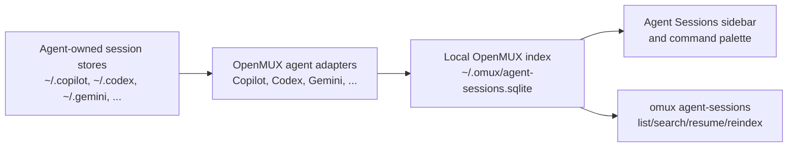
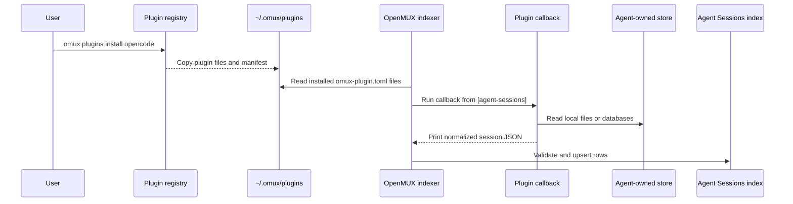
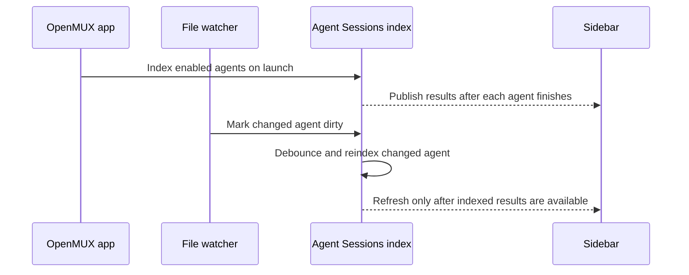
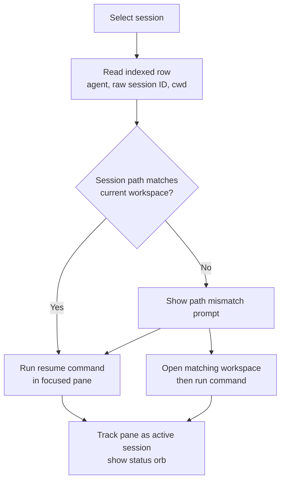

# Agent Sessions

Agent Sessions is OpenMUX's local view of work you have done with coding agents such as GitHub Copilot, Codex, and Gemini. It lets you search previous sessions, see which sessions are currently active in OpenMUX, resume a session in a terminal pane, and remove sessions from the local OpenMUX index.

Agent Sessions is local-first. OpenMUX reads session metadata from agent-owned files on your Mac and stores a searchable index under `~/.omux/`. It does not upload transcripts or agent data.

## What you can do

- Open the sidebar from **View -> Toggle Agent Sessions**, **Agents -> Show Agent Sessions**, or the command palette.
- Filter by workspace and agent.
- Search indexed session titles, agent names, paths, and IDs.
- Resume a session in the focused terminal pane.
- See active sessions and their status orb when a resumed session is running in an OpenMUX pane.
- Delete a session from the row context menu.

CLI entry points:

```bash
omux agent-sessions open
omux agent-sessions list
omux agent-sessions search "release notes"
omux agent-sessions reindex
```


## How sessions are loaded

OpenMUX keeps a local SQLite index at `~/.omux/agent-sessions.sqlite`. The index stores one normalized row per session: agent, session ID, source kind/path, cwd, title, updated time, and a local deleted flag.



OpenMUX ships built-in adapters for bundled agents and can also load adapter capabilities declared by installed plugins:

| Agent                         | Primary source                                     | Notes                                                                                                                                                                                                                                                       |
|-------------------------------|----------------------------------------------------|-------------------------------------------------------------------------------------------------------------------------------------------------------------------------------------------------------------------------------------------------------------|
| Copilot                       | `~/.copilot/session-store.db`                      | Reads the `sessions` table directly (`id`, `cwd`, `summary`, `updated_at`). Recent `session-state` files are used only when the database is unavailable or empty, so normal startup does not block on scanning large session-state files.                   |
| Codex                         | `~/.codex` state databases and JSONL session files | Uses readable state SQLite databases as authoritative when they contain sessions. JSONL rollout files are a fallback for missing, unreadable, incompatible, or empty databases, and stale JSONL fallback rows are removed after successful SQLite indexing. |
| Gemini                        | `~/.gemini/tmp/**/logs.json`                       | Groups log rows by session ID and uses message timestamps.                                                                                                                                                                                                  |
| External (plugin-declared)    | Plugin-declared callback output                    | A plugin can declare an Agent Sessions adapter capability in `omux-plugin.toml`; OpenMUX invokes the callback during reindex and indexes the normalized JSON rows it prints.                                                                                |

You can override built-in agent homes, disable built-in adapters, and enable or disable plugin adapters in `~/.omux/config.toml`; see [Configuration](./configuration.md#agent-sessions-settings).
Plugin adapter names shown in the UI and config come from plugin manifest metadata (`[agent-sessions].name` when set, otherwise `[plugin].command`).

## Plugin-provided agents

Agent Sessions plugins are ordinary OpenMUX plugins with an `[agent-sessions]` capability in their installed `omux-plugin.toml`. They are useful when an agent stores session metadata in a format OpenMUX does not ship as a built-in adapter, or when a community plugin wants to provide better support for a bundled agent.



The callback contract is intentionally small:

- The plugin reads its own source data, such as SQLite, JSONL, local logs, or a vendor-specific cache.
- The plugin writes normalized JSON rows to stdout.
- OpenMUX validates and indexes those rows.
- OpenMUX handles sidebar display, search, delete/hide state, workspace mismatch prompts, and resume execution.

A minimal manifest capability looks like:

```toml
[plugin]
command = "agent-sessions.opencode"
entrypoint = "plugin"

[agent-sessions]
name = "opencode"
callback = "__omux_agent_sessions"
arguments = ["discover"]
source_kind = "opencode_sqlite"
resume_command = "opencode -s {session_id}"
```

For the full public plugin contract, including JSON fields and packaging requirements, see [Plugin ecosystem: Agent Sessions adapter capability](./plugins.md#agent-sessions-adapter-capability).

## Indexing and refresh behavior

OpenMUX indexes sessions at startup when Agent Sessions is enabled and `index_on_launch` is true. It also watches known agent directories for changes and performs small background refreshes when files change.



The sidebar keeps existing rows visible while refreshes run. It updates the row list only when the indexed result set changes, so a refresh should not blank the pane or blink through an empty state. Sidebar pages fetch `sidebar_rows_per_agent` rows per enabled agent, defaulting to 10.

If new sessions do not appear immediately, use **Agents -> Reindex Agent Sessions** or the refresh button in the sidebar. The CLI equivalent is:

```bash
omux agent-sessions reindex
```

## Resume flow

Each indexed session can be resumed if its agent has a resume command. OpenMUX builds the command from the agent type and raw session ID, for example:

```text
copilot --resume '<session-id>'
codex resume '<session-id>'
gemini --resume '<session-id>'
```

You can customize resume commands per agent in config.



When a resumed session runs in an OpenMUX pane, the Agent Sessions sidebar marks the row as **ACTIVE**. The status orb uses the same states as pane tabs:

| Orb state      | Meaning                      |
|----------------|------------------------------|
| Pulsing accent | The agent is working.        |
| Yellow         | The agent needs input.       |
| Blue           | The agent is idle.           |
| Red            | The agent reported an error. |

Status comes from the same pane status pipeline used by workspace pane tabs, including the bundled AI Status plugin when enabled.

Active sessions are pinned to the top of the list and shown with the status orb on the date row. Use the open/focus icon on a row to resume it or jump to the existing tab/pane where that session is running.

## Searching and filtering

The sidebar filters on:

- workspace scope: current workspace, all workspaces, or a specific workspace
- agent: all agents or one agent
- search text: session title, agent name, path, and ID

The CLI uses the same index:

```bash
omux agent-sessions list
omux agent-sessions search "release notes"
omux agent-sessions resume copilot:<session-id> --workspace
```

## Deleting sessions

Use **Delete Session...** from a row's context menu to hide the session in OpenMUX. OpenMUX marks the normalized row as deleted in its local index and filters it out of the sidebar, palette, CLI, and control-plane results.

Deletion does not modify Copilot, Codex, Gemini, or other upstream agent files/databases. If the agent updates the same session later, OpenMUX may refresh the indexed metadata while keeping the local deleted flag.

## Configuration

Agent Sessions is enabled by default. A minimal config looks like:

```toml
[agent-sessions]
enabled = true
preview_enabled = true
index_on_launch = true
collapsed_toggle_visible = true

[agent-sessions.external.opencode]
enabled = true
```

By default, OpenMUX indexes bundled built-in adapters and all installed plugin adapters. Use `included_agents` only when you want to replace the built-in adapter allowlist. Plugin adapters do not need to be added there; they are discovered from installed plugin manifests and controlled through `[agent-sessions.external.<name>]`.

See [Configuration](./configuration.md#agent-sessions-settings) for the full key list.
