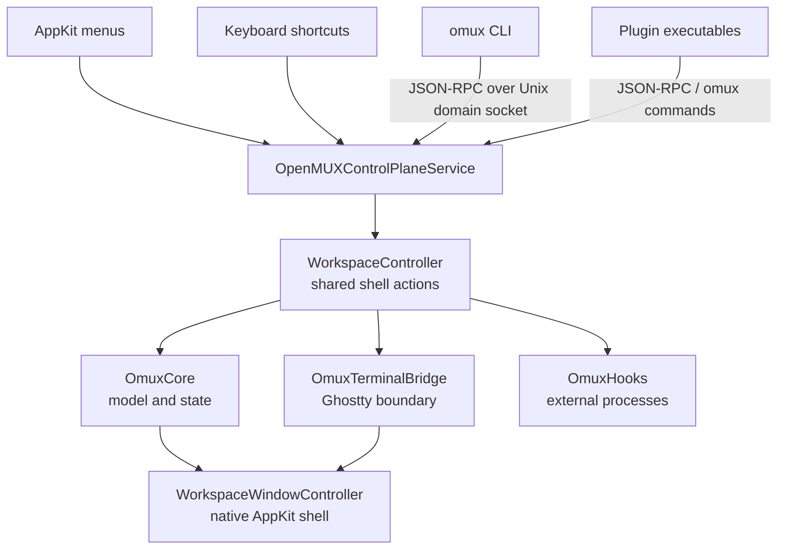
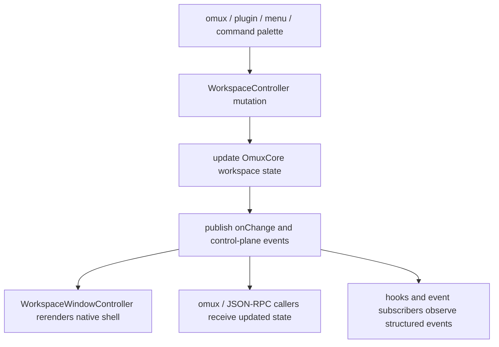
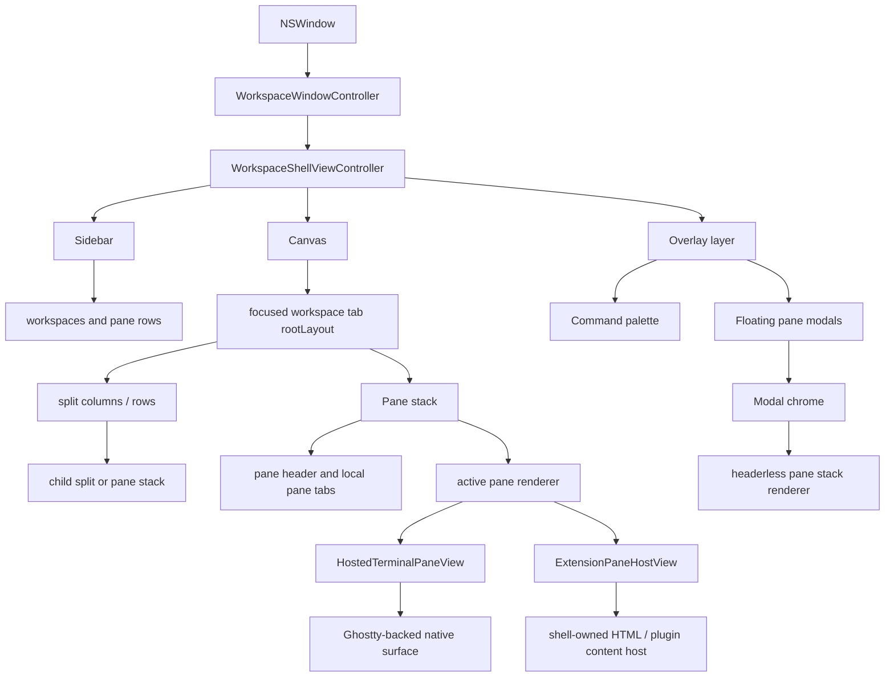
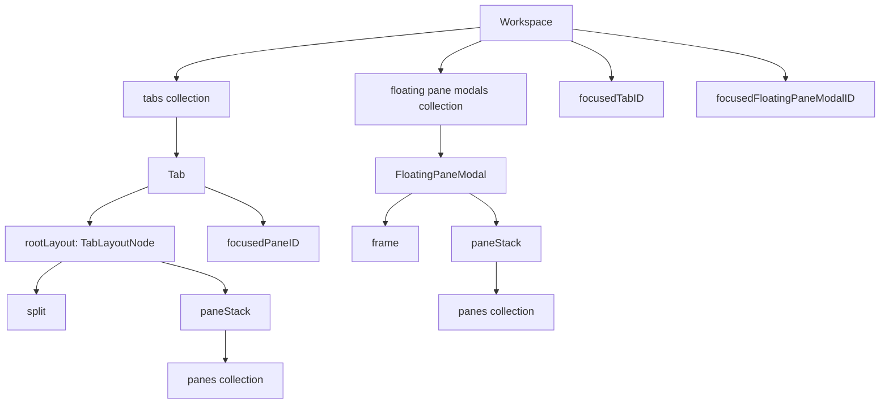
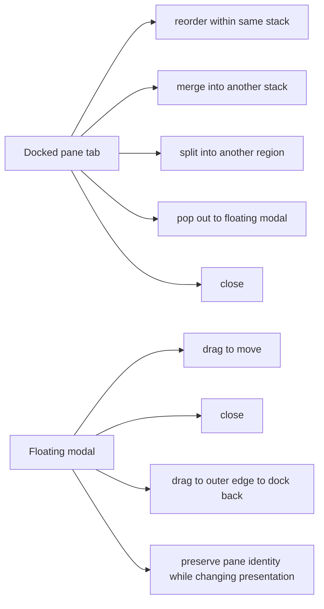
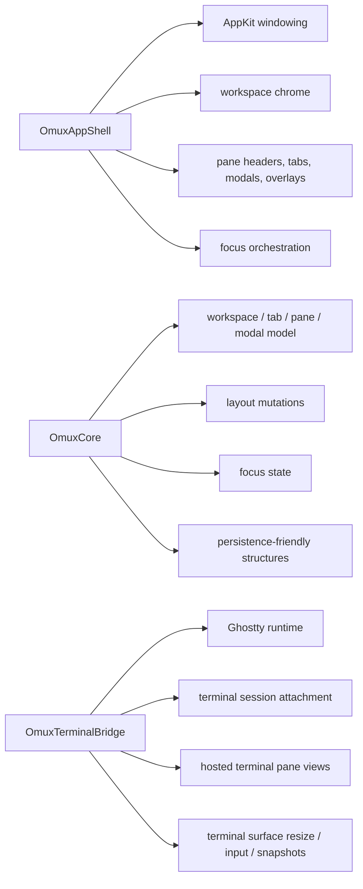

# OpenMUX Architecture Overview

This page is the contributor-oriented map of how OpenMUX is structured today: how it **speaks** to automation and plugins, how it **renders** the shell, and how the workspace, pane, tab, and modal model fits together.

OpenMUX stays terminal-first by keeping the terminal runtime behind one bridge and reusing the same workspace model across the native shell, CLI, control plane, hooks, and plugins.

## System map

## How OpenMUX speaks

OpenMUX has one shared action layer on purpose.

### Why this matters

- The CLI does not own a second workspace model.
- Plugins do not talk to AppKit directly.
- The native shell, command palette, menus, and `omux` all mutate the same live objects.
- `libghostty` stays behind `OmuxTerminalBridge` instead of leaking into shell code.

## How OpenMUX renders

The app window is shell-owned. Terminals and extension panes are hosted inside that shell.

The important detail is that floating modals are **not** a second plugin UI system. A modal is another shell presentation of pane content, built from the same pane model and renderers.

## Workspace model

OpenMUX models docked and floating presentation separately, but they still reference the same pane identity concept.

### Relationships

- A **workspace** owns docked tabs and any floating pane modals.
- A **tab** owns a recursive split tree.
- A **pane stack** is the leaf node of that split tree.
- A **pane** is the actual terminal or extension content identity.
- A **floating modal** owns a pane stack too, so modal content still uses pane-stack semantics.

## Pane, tab, and modal behavior

Today, the shell supports:

- docked pane stacks with local pane tabs
- floating pane modals for extension content and docked pane pop-out
- pop-out through pane-tab drag release in the center region
- pop-out through pane-tab context menus
- dock-back by dragging a floating modal to a workspace edge

Docking back into a specific existing pane stack is still follow-on work. Current dock-back targets the root layout edge of the active tab.

## Presentation and plugin ownership

Extension panes carry `presentationStyle` metadata:

- `pane-tab`
- `modal`

That metadata flows through:

- `omux extension-pane`
- bundled plugin commands such as `omux markdown-preview`
- JSON-RPC control-plane requests
- workspace persistence
- shell-driven dock / undock moves

This keeps plugin-owned panes consistent whether they were opened directly as a modal, created as a docked pane tab, or moved by the user afterward.

## Boundary summary

If a change crosses those boundaries, it should do so intentionally and through shared contracts, not by reaching around them.
