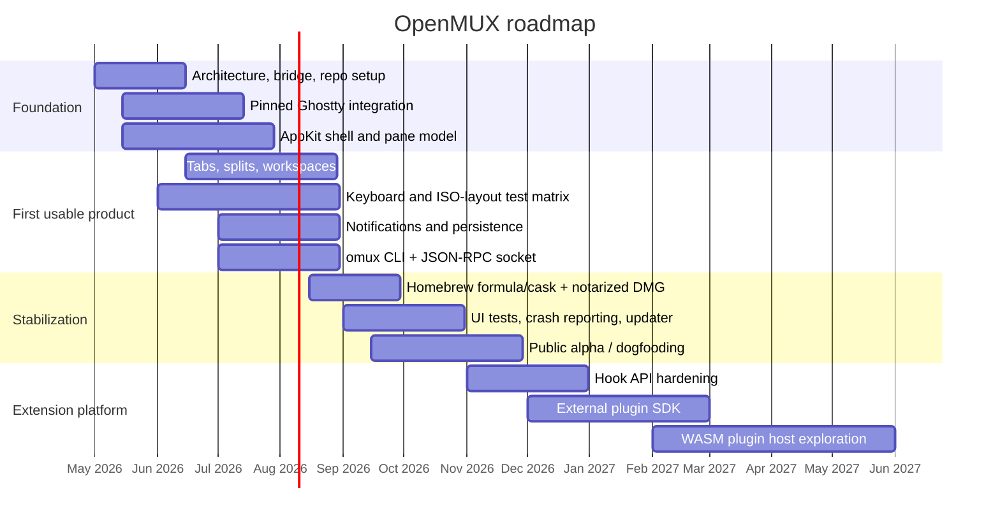

# Foundations for a macOS OpenMUX Rewrite with libghostty

## Executive summary

A native macOS OpenMUX rewrite is technically well-founded if you treat **libghostty as a pinned, unstable upstream dependency behind your own narrow adapter layer**, and if you build the desktop app as an **AppKit-first macOS application with selective SwiftUI for non-terminal chrome**. That recommendation follows from three facts in the primary sources: Ghostty explicitly positions libghostty as an embeddable C and Zig library for terminal functionality, its `Surface` abstraction already matches the mental model you want for tabs, splits, and panes, and Ghostty’s own macOS app is itself a native Swift/AppKit/SwiftUI application rather than a web shell. At the same time, Ghostty’s full embedding API is not yet documented as a polished general-purpose product API; Ghostty’s own header says the embedding API documentation mostly lives in Zig source and that the only current consumer is the macOS app. That means OpenMUX should depend on libghostty deliberately, but **not spray libghostty calls throughout the whole codebase**. citeturn34search6turn28view0turn26view0turn4view4

The clearest architecture for v1 is this: **Swift + AppKit for the app shell**, **Swift Package Manager modules for shared core logic and the `omux` CLI**, **a thin C/Swift bridge around pinned libghostty**, **JSON-RPC over a Unix domain socket for app–CLI control**, and **out-of-process hooks/plugins first, in-process WASM later**. That stack preserves native keyboard/input behavior, accessibility, menus, notifications, and distribution ergonomics on macOS, while keeping extension logic isolated and testable. It also aligns with Apple’s platform model for native apps, Homebrew’s packaging split between formulae and casks, and GitHub Actions’ macOS runner model for CI/CD. citeturn11search11turn11search0turn9search16turn9search0turn12search1turn13search1turn13search0turn31search0turn10search0turn10search1

For distribution, the strongest recommendation is **Developer ID signing + notarized DMG for the GUI app, plus a Homebrew cask for the app and a separate Homebrew formula for the CLI**. The **Mac App Store should not be a v1 target** for a serious terminal/workspace tool. Apple requires App Sandbox for Mac App Store distribution, sandboxed child processes inherit the parent sandbox, and Apple’s sandbox guidance says apps cannot use user-selected file entitlements to run programs outside the app bundle, sandbox container, or app group containers. For a terminal emulator that needs to spawn shells and arbitrary user tools, this is a poor fit. citeturn29search7turn12search8turn12search21turn9search2turn9search6turn13search0turn13search1turn13search2

On licensing, your instinct to do a **clean rewrite rather than a fork** is strategically correct. Ghostty is MIT-licensed, which is permissive and broadly compatible with either MIT or Apache-2.0 downstream licensing. cmux, by contrast, is GPL-3.0-or-later and the project publicly states that it relicensed from AGPL-3.0 to GPL-3.0 in March 2026. That means **copying cmux code into OpenMUX would create GPL obligations on distribution**, whereas a clean-room rewrite that reuses ideas, behavior, and public requirements but does not copy code keeps your options open. For OpenMUX itself, **Apache-2.0 is the stronger choice over MIT** if you want a broad ecosystem with contributors and extension authors, because Apache-2.0 is permissive while also carrying an express patent grant; MIT is simpler, but gives less explicit protection around patents. This is practical project guidance, not legal advice. citeturn20search3turn20search0turn20search4turn20search2turn35search0turn35search1turn35search5

## Assumptions

This report assumes OpenMUX is a **macOS-only desktop product for v1**, with a **native GUI app** and a **local CLI binary named `omux`**, and that cross-platform support is not an immediate goal. It also assumes that **deep browser embedding is not part of the first release**, because your stated design direction emphasizes terminal multiplexing, hooks, sane defaults, and keyboard correctness over reproducing cmux’s embedded browser. Where exact targets were unspecified, the recommended baseline is **modern macOS only**, with backward-compatibility evaluated after the core architecture and keyboard/input model are stable.

A practical baseline assumption for planning is **macOS 14 or newer for v1**, even though Ghostty’s official Swift Package XCFramework example targets macOS 13. That recommendation is not because earlier versions are impossible, but because modern AppKit, notarization, Swift toolchains, and keyboard/input testing are materially easier when you trim the support matrix. Ghostty’s Swift Package example does demonstrate that the libghostty-vt XCFramework path is already consumable from Swift on macOS. citeturn25view0

## libghostty as the technical foundation

Ghostty describes libghostty as a **cross-platform, zero-dependency C and Zig library** for building terminal emulators and for using terminal functionality such as style parsing. The project README explicitly says that anyone can use libghostty to build a terminal emulator or embed a terminal into their own applications, and it points developers to Ghostling and the `example/` directory as implementation references. That is strong evidence that OpenMUX’s high-level concept is aligned with upstream intent. citeturn34search6turn34search10

The most important caveat is that the **full embedding API is still somewhat “insider” territory**. Ghostty’s `include/ghostty.h` says the embedding API documentation is “only within the Zig source files,” that it “isn’t meant to be a general purpose embedding API (yet),” and that “the only consumer of this API is the macOS app,” even if the API is being built to become more general-purpose. That line should shape the entire OpenMUX design: **pin exact Ghostty commits, wrap the unstable surface API in your own bridge crate/module, and expose a stable OpenMUX-internal interface to the rest of the app**. citeturn26view0turn26view1

At a conceptual level, Ghostty’s `Surface` abstraction is a very good fit for OpenMUX. Ghostty documents `Surface` as a single terminal “surface,” a minimal widget that draws the terminal, handles keyboard and mouse events, and **creates and owns its PTY session**. Higher-level runtime code decides whether a surface behaves as a window, tab, split, or preview pane. That is almost exactly the seam OpenMUX needs: your workspace model can own layout, tabs, focus, persistence, and notifications, while libghostty owns the hard part of terminal emulation, rendering, and PTY-backed terminal state. citeturn28view0turn28view1

There are two different Ghostty layers to keep distinct. The **headless/VT-oriented path** is comparatively mature and well illustrated by the official examples. Ghostty’s examples directory includes C, C++, Zig, Swift, and WebAssembly demonstrations such as `c-vt-render`, `c-vt-stream`, `c-vt-encode-key`, `c-vt-encode-mouse`, `cpp-vt-stream`, `swift-vt-xcframework`, `wasm-vt`, and `zig-vt`. The official Swift example shows a prebuilt `ghostty-vt.xcframework` being consumed as a Swift Package `binaryTarget`, built from the repository root with `zig build -Demit-lib-vt`. If OpenMUX needed only terminal parsing and headless state, this path would already be very comfortable. citeturn8view0turn23view0turn25view0

For a full desktop terminal application, however, you will eventually use the broader embedding surface rather than only `libghostty-vt`. The C header shows opaque app/config/surface/inspector handles, platform/runtime enums, and modifier state that includes **left/right-specific variants** for Alt, Shift, Ctrl, and Super. That is especially relevant for your EU-keyboard requirement: it means Ghostty’s own model does not collapse modifier state into a single “Option” bit; the backend already has room for the distinction that cmux currently fumbles in the right-Option issue you linked. The lesson for OpenMUX is that you should preserve that distinction all the way from Cocoa event capture into your libghostty bridge and then lock it down with regression tests. citeturn4view0turn22view0

On bindings, the official story today is strongest for **C and Zig**, with **Swift interop demonstrated officially** via the XCFramework example. Rust support exists, but it is community-maintained rather than official. Notable current Rust efforts include `Uzaaft/libghostty-rs`, which advertises raw FFI bindings plus safe wrappers for `Terminal`, `RenderState`, and encoders, and `Hamish-taylor/rust-libghosty`, which vendors Ghostty and builds `libghostty-vt` automatically from `build.rs`. The community “awesome-libghostty” index also shows additional bindings and example clients across Swift Package Manager, Go, Dart, and several macOS-terminal experiments. That is encouraging for ecosystem direction, but for a production OpenMUX app you should still treat **official C ABI + Swift bridge** as the stable center of gravity. citeturn34search3turn34search1turn34search5

The licensing implications are favorable for a rewrite. Ghostty’s repository is MIT-licensed. The MIT license allows use, modification, distribution, and sublicensing with preservation of copyright and license notices. In practical terms, that means you can link against libghostty, vendor headers, or even incorporate MIT-licensed Ghostty code into an Apache-2.0 or MIT-licensed OpenMUX, provided you preserve the required notices. citeturn20search0turn20search3turn35search1

## macOS framework comparison

For a terminal emulator on macOS, the framework decision is not mainly about “how do I draw windows?” It is about **keyboard/input fidelity, IME and dead-key handling, focus, accessibility, menus, window management, and packaging friction**. Apple’s own AppKit documentation emphasizes that AppKit handles event management and interaction in macOS apps, while `NSTextInputClient` and `NSTextInputContext` exist specifically for custom text views that need to participate correctly in the system text input pipeline. SwiftUI can interoperate with AppKit through `NSViewRepresentable`, but Apple is explicit that this is a wrapper for hosting AppKit views in a SwiftUI hierarchy. That is why the best pattern is hybrid rather than pure. citeturn11search11turn11search0turn11search6turn9search0turn9search16

| Framework choice | Terminal UX fit | Accessibility and keyboard handling | Performance and footprint | Distribution and signing | Recommendation | Official basis |
|---|---|---|---|---|---|---|
| **AppKit-first with selective SwiftUI** | Best fit for panes, focus, menus, custom event routing, native windowing | Strongest native story; custom views can implement `NSTextInputClient`; AppKit owns event flow; SwiftUI can host AppKit using `NSViewRepresentable` | Native, no browser stack | Straight-through Xcode, Developer ID, notarization | **Recommended default** | citeturn11search11turn11search0turn11search6turn9search0turn9search16turn4view4 |
| **SwiftUI-only** | Fine for settings, sidebars, command palette, onboarding; weak as the sole terminal surface layer | Good built-in accessibility, but real terminal views still push you toward AppKit wrappers | Native, but control is more indirect for low-level terminal interactions | Excellent with Apple tooling | Use only for non-terminal chrome | citeturn9search8turn9search0turn9search16 |
| **Mac Catalyst** | Acceptable only if you already have an iPad codebase; weaker desktop fit for terminal-first UX | UIKit keyboard/menu support exists, but Catalyst only gets AppKit APIs Apple exposes to Catalyst | Native-ish, but not as “Mac-first” | Supported by Apple, but compromises desktop-native behavior | Not recommended for OpenMUX | citeturn9search5turn9search17turn9search9 |
| **Tauri** | Good for dashboards/settings/companion UX; awkward for a precision terminal surface | Web accessibility model plus native plugins; keyboard model still flows through webview architecture | Smaller than Electron because it uses the system webview | Signing/notarization still required on macOS | Viable only if you accept a webview UI layer | citeturn14search0turn14search11turn14search16turn33search0turn33search2 |
| **Electron** | Works, but you inherit Chromium’s multi-process web-app model for a product whose core value is native terminal UX | Accessibility is web-like; keyboard/menu work is possible but mediated by Electron/Chromium | Heavier process/browser footprint than native | Mature tooling, but still needs code signing and notarization | Not recommended for this product thesis | citeturn14search9turn14search17turn33search1turn33search11 |
| **Native C plus SDL** | High-control rendering/input path, especially if cross-platform later becomes primary | Good raw keyboard/scancode story, but you must build more macOS-native accessibility and app semantics yourself | Excellent raw performance | Native signing works, but more platform plumbing is yours to own | Secondary option, best only if cross-platform becomes a top priority | citeturn14search2turn14search6turn14search10turn14search18 |

The specific keyboard lesson for OpenMUX is worth calling out. Apple’s event APIs expose raw key event data such as `keyCode`, `modifierFlags`, and `charactersIgnoringModifiers`, and custom text views are expected to integrate with `NSTextInputClient` and `NSTextInputContext`. Ghostty’s own C API then provides side-specific modifier flags. Combined with the cmux issue demonstrating that the right-Option path matters for Swedish and other ISO layouts, the safest approach is **AppKit capture → your normalized key event layer → libghostty bridge → exhaustive regression tests for ISO layouts, dead keys, Alt/Meta editors, and `macos-option-as-alt = right` behavior**. citeturn11search4turn11search1turn11search22turn11search0turn11search6turn4view0turn22view0

My recommendation, therefore, is not merely “use native.” It is more specific: **use AppKit as the spine of the terminal/workspace shell, use SwiftUI as a convenience layer for settings and chrome where it helps, and keep the terminal surface itself in an AppKit-hosted view.** That mirrors both Apple’s tool story and Ghostty’s own native macOS implementation. citeturn11search11turn9search0turn4view4turn4view3

## Build, packaging, distribution, and CI/CD

The cleanest build model is **Xcode for the app target and release packaging, Swift Package Manager for shared modules and the `omux` CLI, and a pinned Ghostty build step that emits a library artifact consumed by your app/CLI bridge**. SwiftPM officially supports packages, tests, executables, and binary dependencies, and Ghostty’s own Swift example demonstrates a Swift Package consuming a prebuilt `ghostty-vt.xcframework` as a `binaryTarget`. That provides a credible template for wrapping Ghostty artifacts without making your entire application build depend directly on Ghostty’s internal layout. citeturn12search1turn12search3turn25view0

For packaging, use **two Homebrew artifacts** and **one direct-download artifact**. Homebrew’s documentation distinguishes formulae from casks, and its tap documentation supports maintaining both in your own repository namespace. The best distribution pattern for OpenMUX is: a **Homebrew cask** for the notarized `.app` or `.dmg`, a **Homebrew formula** for the `omux` CLI, and a **direct notarized DMG download** for users who prefer standard macOS installation. Homebrew’s cask docs explicitly cover `.app` bundles and `.pkg` installers, while formula docs and bottle docs cover CLI packaging and binary distribution. citeturn13search0turn13search1turn13search2turn13search10

Outside the Mac App Store, Apple’s distribution path is straightforward in principle: sign with **Developer ID**, then notarize. Apple’s documentation says Gatekeeper checks for a Developer ID certificate on software distributed outside the Mac App Store, and notarization is the additional verification step for distributed software. Apple also notes that uploads using the legacy `altool` / old Xcode path are no longer accepted, so modern notarization tooling should be part of your pipeline from the start. Electron and Tauri’s macOS distribution docs say essentially the same thing from their side: code signing is required, and notarization is required for direct distribution outside the App Store. citeturn9search6turn9search2turn9search18turn33search1turn33search0turn33search2

The Mac App Store is the wrong default target for OpenMUX. Apple requires App Sandbox for Mac App Store distribution. App Sandbox restricts file system and system-resource access through entitlements, and Apple’s `Process` documentation says that child processes launched by a sandboxed app inherit the sandbox of the parent app. Apple’s sandbox file-access guidance further says that user-selected-file entitlements do **not** let the app run programs outside its bundle, sandbox container, or app group containers. For a terminal/workspace product whose value depends on launching shells, tools, and user workflows, that combination is fundamentally constraining. A later MAS companion app is conceivable, but **not the main OpenMUX desktop product**. citeturn29search7turn12search2turn12search8turn12search21

For CI/CD, GitHub-hosted macOS runners are adequate to start, and GitHub provides official guidance for installing Apple certificates on macOS runners for Xcode builds. GitHub also documents both hosted and self-hosted runners; hosted macOS runners are easy, while self-hosted gives you more control over the environment. GitHub’s billing docs note that macOS runners cost more than Linux or Windows runners, so a sensible plan is: **hosted macOS runners in the first phase, self-hosted Macs for release/signing/notarization only if scale or cost begins to hurt**. citeturn10search1turn10search0turn10search3turn10search19

The recommended release pipeline is therefore:

- build/test shared SwiftPM modules on Linux and macOS where possible;
- build the app and UI tests on macOS;
- build or fetch the pinned Ghostty artifact on macOS;
- sign and notarize the app;
- publish a notarized DMG plus release checksums;
- publish a Homebrew cask update for the app;
- publish a Homebrew formula update or bottle for the CLI. citeturn12search1turn25view0turn13search2turn13search10turn10search1turn9search2

## Plugin and hook architecture

The extension model should be **phased**, not maximalist from day one. For v1, OpenMUX should ship with **hooks and an external plugin protocol**, not with a “run arbitrary code in the app process” system. JSON-RPC 2.0 is a very strong default for this because the specification is explicitly **stateless, light-weight, transport agnostic**, and supports **notifications** without responses. That makes it well suited for a local CLI-to-app protocol over a Unix domain socket, and also for plugin daemons speaking over stdio or sockets. The architecture is simple enough to inspect and debug, but structured enough for long-term versioning. citeturn31search0

For macOS-local control, **Unix domain socket + JSON-RPC** is the recommended default protocol. It fits the single-user desktop model, works naturally with a CLI, is transport-agnostic by specification, and supports both request/response commands and fire-and-forget notifications. Compared with gRPC, it is much lighter and easier to debug by hand. gRPC is excellent when you need strongly typed, distributed service boundaries across teams and languages, but that is a heavier fit for a local desktop app and CLI pair. citeturn31search0turn30search3turn30search11

Where process isolation matters on macOS, **XPC** is the platform-native alternative. Apple describes XPC as a lightweight IPC mechanism that lets you create helper tools and services, and Apple’s sandbox diagnostics guidance explicitly suggests XPC services, login items, or helper apps when you need helpers with different entitlements. That makes XPC the right tool for **OS-integrated helpers** or **sandbox-separated services**, but not the right default for the cross-tooling extension API you want plugin authors to target. It is a macOS-specific implementation detail, not a good universal plugin contract. citeturn29search5turn29search0turn29search3turn29search6

For scripting choices, the tradeoffs are sharp:

**Lua** is attractive because it is explicitly designed as an embedded extension language started from C code in the host program. That gives you a very small footprint and a mature “host app embeds script runtime” model. The downside is that Lua itself is not a security boundary; if you expose dangerous host functions, Lua plugins are as trusted as native plugins. Use Lua only if you want a small, trusted automation DSL. citeturn30search0turn30search8turn30search12

**Deno** is the strongest JavaScript/TypeScript option if security boundaries matter. Deno’s runtime documentation says it is secure by default and that code has no file, network, environment, or subprocess access unless granted. That is precisely the right posture for user-installed automation hooks. The downside is operational complexity: embedding or shipping Deno is heavier than Lua, and integrating a JS runtime into a Swift/macOS app is more work than simply spawning an external plugin process. My recommendation is to treat Deno as a **second-phase plugin runtime**, likely out-of-process at first. citeturn30search1turn30search9turn30search17

**Node** has ecosystem gravity and an official embedder API, but its embedding docs are candid that embedded-library breaking changes can occur on semver-major releases without the usual deprecation guarantees. Node also has a permission model, but the official docs still position it as a flag-based restriction system rather than a magically complete sandbox. For OpenMUX, that means Node can be supported as an external plugin runtime for ecosystem reach, but it is **not the best first-class embedded extension engine**. citeturn32search1turn32search0turn32search18

**WASM via Wasmtime** is the most compelling long-term path for **untrusted or semi-trusted in-process plugins**. Wasmtime documents itself as a library that embeds WebAssembly outside the browser, with security and correctness as primary goals, and it supports WASI and the component model. This fits OpenMUX well if you want eventually to let plugins interact with typed host capabilities such as panes, workspaces, keybindings, notifications, and layout events without granting them raw process access. The catch is developer ergonomics and ABI design: this is the best end-state, but not necessarily the fastest v1. citeturn30search2turn30search14turn30search10

The best phased strategy is therefore:

**Phase one**: lifecycle hooks plus an external JSON-RPC protocol over Unix sockets or stdio.  
**Phase two**: a plugins SDK with typed schemas and explicit capability grants.  
**Phase three**: a WASM host for sandboxed plugins, with optional Deno bridge for TypeScript authors.  

That keeps OpenMUX open and extensible without locking the entire application to a heavyweight web-runtime decision too early. citeturn31search0turn30search2turn30search1

## Project structure, workflow, and licensing

The safest use of cmux as inspiration is **architectural observation, not code reuse**. The current cmux repository clearly separates native app code, CLI code, packages, resources, tests, UI tests, docs, web assets, vendor content, a Homebrew tap, and entitlements. Its root includes `CLI`, `Packages`, `Sources`, `Resources`, `cmuxTests`, `cmuxUITests`, `docs`, `homebrew-cmux`, `ghostty`, and multiple entitlements files; inside `Sources` it further separates areas such as `App`, `Panels`, `Sidebar`, `Settings`, `Windowing`, `CommandPalette`, `Feed`, `Find`, and a large terminal/window layer. That structure is useful as a signals map for product complexity, but because cmux is GPL-3.0-or-later, OpenMUX should **not copy code, file contents, or specific implementations** from it if you want to keep your own licensing options open. citeturn18view0turn19view0turn20search4turn20search2

A clean OpenMUX monorepo should look more like this conceptually:

```text
openmux/
  App/
    OpenMUX.xcodeproj
    OpenMUXApp/
    OpenMUXUITests/
  CLI/
    omux/
  Packages/
    OmuxCore/
    OmuxTerminalBridge/
    OmuxRPC/
    OmuxWorkspace/
    OmuxHooks/
    OmuxPluginAPI/
    OmuxSettings/
    OmuxPersistence/
  Vendor/
    ghostty/            # pinned submodule or mirrored source snapshot
  Scripts/
    build-ghostty.sh
    notarize.sh
    release.sh
  Docs/
    architecture/
    plugin-api/
    adr/
  Examples/
    plugins/
    hooks/
  .github/workflows/
```

The key design point is **one narrow module called something like `OmuxTerminalBridge`** that is the only package allowed to touch libghostty directly. Everything else should speak in OpenMUX-native types: panes, surfaces, workspaces, sessions, keymaps, notifications, hooks, and persistence. That creates a clean shock absorber between upstream Ghostty churn and your product logic. This recommendation follows directly from Ghostty’s own warning that the full embedding API is not yet a polished general-purpose surface. citeturn26view0

For language choices, the strongest default is **Swift for the app, Swift for the CLI, and C only at the bridge edge**. That keeps the entire product native to macOS tooling, reuse-friendly between GUI and CLI, and close to Ghostty’s officially demonstrated Swift-consumption path. Zig remains Ghostty’s natural upstream world, but you do not need to make Zig the primary implementation language of OpenMUX itself to benefit from libghostty. Rust stays optional: it is attractive for future plugin runtimes or utility services, but it is not necessary to get the core desktop product right. citeturn25view0turn4view4turn34search6

The day-to-day developer workflow should be native and boring in the best sense: use **Xcode** for app/UI work, **SwiftPM** for shared modules and the CLI, **GitHub Actions** for unit and UI test automation, and a **pinned Ghostty commit** updated intentionally rather than continuously. Regression suites should include keyboard-layout scenarios from the beginning, especially Swedish/German/French ISO layouts, dead keys, Alt/Meta editor behavior, and the specific right-Option semantics demonstrated by the cmux bug report. Ghostty’s API model and the cmux issue together make this a first-order requirement, not a polish item. citeturn12search1turn10search4turn10search1turn4view0turn22view0

On your own license, **Apache-2.0 is the better recommendation than MIT** for OpenMUX. Both are permissive and both are compatible with MIT-licensed Ghostty inputs. MIT is shorter and simpler. Apache-2.0, however, remains permissive while adding an **express patent grant** and explicit conditions around notices and modified files. In a project that aims to support hooks, extensions, and potentially a contributor ecosystem, that added clarity is meaningful. If your top value were “smallest possible legal text,” MIT would be fine. If your top value is “widest ecosystem adoption with slightly stronger contributor/professional assurances,” choose Apache-2.0. citeturn35search0turn35search5turn35search1

## V1 scope, roadmap, open questions, and prioritized sources

The right v1 is **not** “cmux minus browser” and **not** “Ghostty clone plus tabs.” It is a focused native macOS workspace terminal built on libghostty with a clean local-control plane and keyboard correctness as a core quality bar. The recommended v1 scope is:

- multi-window native app with tabs/workspaces and split panes;
- libghostty-backed terminal surfaces;
- keyboard/layout correctness, especially ISO and right-Option behavior;
- notifications and attention model;
- session/workspace persistence for layout and metadata;
- a local Unix-socket RPC service;
- `omux` CLI commands for open, split, focus, send-text, list, notify, and restore-session;
- external hooks on lifecycle events such as workspace-opened, prompt-detected, command-finished, and notification-raised;
- no embedded browser in v1;
- no Mac App Store target in v1. citeturn28view0turn22view0turn31search0turn29search7

The milestone plan below reflects that prioritization.



In plain terms, the roadmap should look like this. In the first three months, build the bridge, native shell, layout model, keyboard pipeline, and the minimal CLI/RPC contract. In months three to six, turn that into a dogfoodable product with persistence, notifications, Homebrew packaging, notarized distribution, and UI test coverage. In months six to twelve, stabilize the hooks API, publish a plugin SDK, and begin a sandboxed extension path with WASM rather than a fully trusted in-process plugin model. citeturn10search1turn13search2turn13search10turn30search2turn31search0

The highest-confidence recommended stack is therefore:

- **Desktop app:** Swift + **AppKit-first** shell, selective SwiftUI for chrome/settings.  
- **Terminal engine:** pinned **libghostty** behind a thin bridge module.  
- **CLI:** `omux` as a SwiftPM executable target sharing core packages.  
- **IPC:** **JSON-RPC over Unix domain socket**.  
- **Extensions:** external hooks first, WASM later, Deno bridge optional.  
- **Build:** Xcode + SwiftPM.  
- **Distribution:** notarized DMG + Homebrew cask + Homebrew formula.  
- **License:** **Apache-2.0**. citeturn11search11turn9search0turn25view0turn31search0turn30search2turn13search0turn13search1turn9search2turn35search0

Open questions and limitations are straightforward. The biggest unsolved question is **how much of the full libghostty embedding API you can rely on without carrying a painful upgrade burden**, because Ghostty itself says that API is not yet a fully general-purpose, externally documented surface. Relatedly, this report did not validate a complete, current matrix of all third-party libghostty wrappers beyond the strongest public signals already available, so the Rust/Go/Dart ecosystem comments should be read as landscape indicators rather than as endorsements. Finally, no specific target macOS compatibility matrix was provided, so the macOS-14+ recommendation is a strategic assumption, not a requirement imposed by the sources. citeturn26view0turn34search5

Priority sources for implementation work are, in order:

- **Ghostty README / About / examples / headers** for what libghostty is, what examples exist, and where the embedding seams really are. citeturn34search6turn34search10turn8view0turn26view0turn28view0
- **Apple AppKit text/input/accessibility docs** for native keyboard handling, custom terminal views, and accessibility semantics. citeturn11search11turn11search0turn11search6turn11search2
- **Apple signing, Developer ID, notarization, and sandbox docs** for distribution and for why MAS is a poor fit for a general terminal product. citeturn9search2turn9search6turn29search7turn12search8turn12search21
- **Homebrew formula/cask/tap docs** for dual distribution of app and CLI. citeturn13search0turn13search1turn13search2turn13search10
- **GitHub Actions macOS signing docs** for CI/CD implementation details. citeturn10search1turn10search0turn10search3
- **cmux repository structure and license sources** as a cautionary reference for scope and clean-room separation, not as code to reuse. citeturn18view0turn19view0turn20search4turn20search2
- **JSON-RPC, XPC, Deno, Wasmtime, and gRPC docs** for the plugin/control-plane design space. citeturn31search0turn29search5turn30search1turn30search2turn30search3