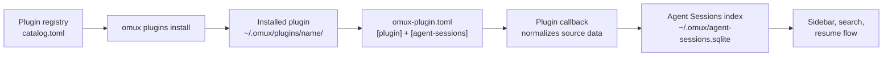

# OpenMUX Plugin Ecosystem

OpenMUX plugins are external, scriptable integrations first. They use the same public `omux` CLI and local JSON-RPC control plane that users can automate from shell scripts. This keeps plugin code outside the terminal engine and lets OpenMUX stay terminal-first.

For bundled plugin user docs, see the [plugin index](./plugins/index.md).

## What plugins can do

Plugins can:

- register top-level `omux` commands
- create, update, and close extension panes
- choose whether extension panes open as docked pane tabs or floating modals
- opt extension panes into host-mediated action callbacks
- contribute Agent Sessions adapters
- contribute native app menu items from installed manifests
- mark terminal pane status with `omux pane-status`
- call any public `omux` command
- react to hooks and terminal text activation events
- use their own runtime through a shebang or native executable

Plugins should not depend on AppKit objects, Ghostty types, or private OpenMUX internals. Stable boundaries are the CLI, JSON-RPC control plane, hooks, and extension-pane descriptors.

## Register a CLI plugin command

User plugins register top-level `omux` commands by installing executables under `~/.omux/plugins/`.

For a single-file plugin, make the file executable:

```sh
mkdir -p ~/.omux/plugins
cp ./my-preview ~/.omux/plugins/my-preview
chmod +x ~/.omux/plugins/my-preview
omux my-preview --help
```

For a plugin that needs bundled files, use a directory with an executable named `plugin`:

```sh
mkdir -p ~/.omux/plugins/my-preview
cp ./run.sh ~/.omux/plugins/my-preview/plugin
chmod +x ~/.omux/plugins/my-preview/plugin
omux my-preview README.md
```

Built-in `omux` commands always take precedence, so a plugin cannot shadow commands such as `config`, `theme`, `history`, or `extension-pane`. Bundled plugins also reserve their command names through this registry; see the [plugin index](./plugins/index.md) for the current bundled list.

Inspect registered plugins with:

```sh
omux plugin path
omux plugin list
omux plugins
```

`omux plugins` opens an interactive picker with fuzzy search. Press Enter on a configurable bundled plugin to toggle it enabled or disabled. External executable plugins are listed as externally registered and remain managed by their files in `~/.omux/plugins/`.

## Registry discovery and install

OpenMUX can discover and install plugin packages from TOML registries. The official default registry is:

```text
https://github.com/finger-gun/omux-plugins
```

Remote registry commands are explicit so the existing picker remains the default for `omux plugins`:

```sh
omux plugins discover
omux plugins discover --json
omux plugins install <plugin-id>
omux plugins update <plugin-id>
omux plugins uninstall <plugin-id>
```

Use `--registry <url>` to discover or install from a custom registry for one command. Registry-installed plugins are copied into `~/.omux/plugins/<command>/` and then discovered by the same local plugin registry as manually installed plugins.

A registry root contains `catalog.toml`:

```toml
schema = 1

[packages.hello-pane]
kind = "plugin"
name = "Hello Pane"
description = "Creates a sample extension pane."
version = "0.1.0"
path = "plugins/hello-pane/omux-plugin.toml"
tags = ["demo"]
```

The package manifest declares the command, entrypoint, and files:

```toml
schema = 1
id = "hello-pane"
name = "Hello Pane"
description = "Creates a sample extension pane."
version = "0.1.0"
license = "Apache-2.0"
kind = "plugin"

[plugin]
command = "hello-pane"
entrypoint = "plugin"

[files.entrypoint]
source = "plugin"
target = "plugin"
executable = true

[files.manifest]
source = "omux-plugin.toml"
target = "omux-plugin.toml"
executable = false
```

Installing a plugin installs executable local code. OpenMUX prints the source registry, package version, and target paths before install; use `--yes` for non-interactive installs. Installed package receipts live under `~/.omux/installed/` so update and uninstall only remove files OpenMUX installed.

## Plugin process environment

When OpenMUX runs a plugin, it passes the remaining CLI arguments through unchanged and adds these environment variables:

| Variable                 | Meaning                                                                         |
|--------------------------|---------------------------------------------------------------------------------|
| `OMUX_PLUGIN_COMMAND`    | Command name the user invoked.                                                  |
| `OMUX_PLUGIN_EXECUTABLE` | Absolute path to the executable OpenMUX launched.                               |
| `OMUX_PLUGINS_DIR`       | Directory containing the plugin executable.                                     |
| `OMUX_CLI`               | Absolute path to the `omux` CLI OpenMUX expects the plugin to call, when known. |

Plugins can call back into `omux extension-pane`, `omux pane-status`, `omux notify`, and other public commands to interact with the running app. Prefer `${OMUX_CLI:-omux}` when launching the CLI so packaged app and Terminal-launched workflows both work.

Installed manifest-based plugin callbacks also receive:

| Variable                | Meaning                                                      |
|-------------------------|--------------------------------------------------------------|
| `OMUX_PLUGIN_HOOK_NAME` | Hook name that caused OpenMUX to invoke the plugin callback. |

Registry-installed plugins can subscribe to hooks directly in `omux-plugin.toml`:

```toml
[hooks.terminal-title-changed]
callback = "__omux_hook"
arguments = ["codex", "title"]
```

OpenMUX invokes the plugin entrypoint with the callback name and arguments, and writes the normal hook JSON payload to stdin. This lets a plugin stay self-contained instead of asking users to install forwarding scripts under `~/.omux/hooks/`.

## Agent Sessions Adapter Capability

Agent Sessions adapters are normal manifest-based plugins. There is no separate adapter registry, no hardcoded list of third-party agent names, and no in-process plugin API. A plugin opts into indexing by adding an `[agent-sessions]` table to its `omux-plugin.toml`.

OpenMUX uses the same installed plugin manifest that powers CLI commands, menu contributions, and manifest-declared hook callbacks:



The plugin does only one job: read whatever source format it owns and print normalized session metadata. OpenMUX owns indexing, filtering, search, delete/hide behavior, workspace matching, sidebar display, and resume execution.

### Manifest Contract

Plugins can contribute Agent Sessions rows by declaring an adapter callback in `omux-plugin.toml`:

```toml
schema = 1
id = "omp"
name = "OMP Agent Sessions"
description = "Indexes OMP sessions."
version = "0.1.0"
license = "Apache-2.0"
kind = "plugin"

[plugin]
command = "agent-sessions.omp"
entrypoint = "plugin"

[agent-sessions]
name = "omp"
callback = "__omux_agent_sessions"
arguments = ["discover"]
source_kind = "omp_jsonl"
resume_command = "omp --resume {session_id}"

[files.entrypoint]
source = "plugin"
target = "plugin"
executable = true

[files.manifest]
source = "omux-plugin.toml"
target = "omux-plugin.toml"
executable = false
```

The `[files.manifest]` entry matters for registry packages. OpenMUX discovers Agent Sessions capabilities from installed manifests under `~/.omux/plugins`, so the package must install its own `omux-plugin.toml`.

| Field                     | Required | Meaning                                                                                       |
|---------------------------|----------|-----------------------------------------------------------------------------------------------|
| `[plugin].command`        | Yes      | Local plugin command. Agent Sessions-only plugins should prefer namespaced commands such as `agent-sessions.opencode`. |
| `[plugin].entrypoint`     | Yes      | Executable file OpenMUX launches for the callback.                                             |
| `[agent-sessions].name`   | No       | Agent Sessions agent name to index and display. Defaults to the plugin command when absent.    |
| `[agent-sessions].callback` | Yes    | First argument passed to the entrypoint during reindex.                                        |
| `[agent-sessions].arguments` | No    | Extra callback arguments after `callback`.                                                     |
| `[agent-sessions].source_kind` | No | Stable source kind stored with indexed rows. Choose a unique, durable namespace (for example `omp_jsonl`) because cleanup and reindex logic use source-kind prefixes; changing it later leaves older indexed rows under the previous namespace. |
| `[agent-sessions].agent`  | No       | Deprecated alias for `name`.                                                                  |
| `[agent-sessions].resume_command` | No | Resume command template. `{session_id}` is replaced with a shell-quoted raw session ID.        |

### Callback Contract

OpenMUX invokes the plugin entrypoint with the callback and arguments during `omux agent-sessions reindex`:

```sh
~/.omux/plugins/agent-sessions.omp/plugin __omux_agent_sessions discover
```

The callback must write only JSON to stdout. Diagnostics should go to stderr. The top-level value may be either a JSON array or an object with a `sessions` array.

```json
[
  {
    "id": "abc123",
    "title": "Fix release notes",
    "cwd": "/Users/example/project",
    "updated_at": "2026-05-21T18:00:00Z",
    "source_path": "/Users/example/.omp/agent/sessions/abc123.jsonl",
    "model": "gpt-5",
    "git_branch": "main"
  }
]
```

Rows use this schema:

| Field        | Required | Meaning                                                                                                    |
|--------------|----------|------------------------------------------------------------------------------------------------------------|
| `id`         | Yes      | Stable upstream session ID. This is the raw value substituted into `{session_id}` for resume commands.      |
| `title`      | No       | Display title. OpenMUX falls back to the session ID when omitted.                                           |
| `cwd`        | No       | Working directory or project root associated with the session.                                             |
| `updated_at` | No       | Last update time. ISO-8601 strings and numeric Unix timestamps are accepted.                                |
| `source_path` | No      | File or database path the row came from, for diagnostics and deletion bookkeeping.                          |
| `model`      | No       | Agent model display string.                                                                                |
| `git_branch` | No      | Git branch display string.                                                                                 |
| `agent`      | No       | Per-row agent name. Use this only when one plugin indexes multiple agents.                                  |

Minimum requirement: each row must include `id`. For reliable grouping, filtering, and ordering, include `cwd` and `updated_at` whenever available from the upstream source.
Indexed session IDs are composed as `<plugin-agent>:<session-id>` (for example `omp:abc123`), where `<plugin-agent>` defaults to the plugin command unless overridden by `[agent-sessions].name`.
OpenMUX validates rows before indexing. Invalid rows are skipped instead of taking down the whole reindex.

### Runtime Environment

Agent Sessions callbacks receive the normal plugin process environment:

| Variable                 | Meaning                                           |
|--------------------------|---------------------------------------------------|
| `OMUX_PLUGIN_COMMAND`    | Plugin command name from the manifest.            |
| `OMUX_PLUGIN_EXECUTABLE` | Absolute path to the launched plugin executable.  |
| `OMUX_PLUGINS_DIR`       | Directory containing the plugin executable.       |
| `OMUX_CLI`               | Absolute path to the `omux` CLI, when known.      |

Callbacks should be deterministic, bounded, and local-first. Prefer reading local files or databases, emitting metadata only, and returning `[]` when the upstream agent is not installed.

### Enable, Disable, and Override

External Agent Sessions adapters are enabled by default. Users can turn off all plugin adapters:

```toml
[agent-sessions]
external_adapters_enabled = false
```

Users can also disable or override one plugin adapter by Agent Sessions name:

```toml
[agent-sessions.external.omp]
enabled = false
resume_command = "omp --resume {session_id}"
```

This works independently from built-in adapters. A community plugin may publish the same agent name as a bundled adapter; users can disable the built-in agent and leave the plugin adapter enabled:

```toml
[agent-sessions.agents.codex]
enabled = false

[agent-sessions.external.codex-plus]
enabled = true
```

## AI status host pattern

The official multi-vendor AI status host is a bundled Swift plugin. It is enabled by default, appears in the plugin picker, and still talks to OpenMUX through the public pane-status surface instead of private terminal state.

The shared `ai-status` host exists so users install one capability and then enable tool-specific adapters behind it, rather than installing one plugin per AI vendor. The host owns debounce, dedupe, target resolution, stale-clear behavior, and manifest-declared hook callbacks. Vendor adapters own their own title rules, hook handling, log reading, and other best-effort detection logic.

Adapters should prefer machine-readable signals when available:

1. wrapper or headless JSON/JSON-RPC streams
2. vendor hooks
3. documented observer signals such as title changes or notifications
4. bounded transcript/history heuristics only as a last resort

Observer adapters must stay read-only with respect to terminal input. They may call public automation such as `omux pane-status`, but they must not intercept or rewrite user keystrokes, IME composition, dead keys, compose sequences, paste, or terminal mouse input.

When a wrapper or observer runs inside an OpenMUX-launched terminal pane, it can rely on terminal session environment identifiers already present in that pane:

- `OMUX_PANE_ID`
- `OMUX_SESSION_ID`

That lets a wrapper target the current pane without scraping OpenMUX UI or depending on private runtime identifiers.

## Config read/apply commands

Plugins that need configuration data should use OpenMUX-owned config commands instead of parsing or rewriting `config.toml` directly:

```sh
omux config get --json
omux config apply --json-file /path/to/payload.json
```

`config get --json` returns the source path, effective supported values, defaults metadata, and diagnostics. `config apply --json-file` accepts supported OpenMUX-owned keys, validates the rendered TOML before replacing the config file, writes a backup, and reloads the running app on success.

## Minimal plugin example

Create `~/.omux/plugins/hello-pane`:

```bash
#!/usr/bin/env bash
set -euo pipefail

omux extension-pane create \
  --plugin dev.example.hello-pane \
  --title "Hello" \
  --html "<main><h1>Hello from a plugin</h1><p>This pane is owned by OpenMUX.</p></main>"
```

Then make it executable and run it:

```sh
chmod +x ~/.omux/plugins/hello-pane
omux hello-pane
```

## Extension pane CLI contract

Use `omux extension-pane` to create, update, and close plugin-owned panes:

```sh
omux extension-pane create --plugin dev.example.preview --title "Preview" --source ./README.md --html-file /tmp/preview.html
omux extension-pane create --plugin dev.example.preview --title "Preview" --source ./README.md --html-file /tmp/preview.html --presentation modal
omux extension-pane update --pane <pane-id> --plugin dev.example.preview --status ready --html-file /tmp/preview.html
omux extension-pane update --pane <pane-id> --plugin dev.example.preview --status error --message "render failed"
omux extension-pane close --pane <pane-id>
```

The control plane accepts these fields:

| Field                                  | Meaning                                                       |
|----------------------------------------|---------------------------------------------------------------|
| `--plugin <id>`                        | Stable plugin identifier. Required for create and update.     |
| `--pane <id>`                          | Existing extension pane to update or close.                   |
| `--title <title>`                      | User-facing pane title.                                       |
| `--source <path>`                      | Local source path represented by the pane.                    |
| `--html <html>` / `--html-file <path>` | Local HTML content for the shell-owned preview host.          |
| `--status ready\|disabled\|error`      | Rendering state. Non-ready states show placeholder copy.      |
| `--message <text>`                     | Placeholder or error message.                                 |
| `--axis columns\|rows`                 | Split direction for new panes.                                |
| `--presentation pane-tab\|modal`       | Initial host presentation for new or updated extension panes. |
| `--actions`                            | Opt the pane into the host-mediated JavaScript action bridge. |

Extension panes are shell-owned content panes. They are not terminal sessions, do not allocate Ghostty surfaces, and terminal-only actions such as `omux run`, `send-text`, and history operations reject or ignore them.

The shell may also move a pane between docked and modal presentation after creation. Plugins should treat pane identity as stable and presentation as host-managed state.

### Extension pane action bridge

By default extension pane JavaScript remains disabled. A plugin that needs form interactions can pass `--actions` when creating or updating a pane. OpenMUX then injects a narrow bridge:

```js
window.omux.submitAction("save", { themeName: "default" })
```

OpenMUX validates that the pane exists, that the plugin ID owns the pane, that the action name is safe, and that the payload is a JSON object. Valid actions invoke the owning external plugin with:

```sh
plugin __omux_action
```

The action request is passed as JSON on stdin and includes `paneID`, `pluginID`, `action`, and `payload`. The plugin can return JSON such as:

```json
{ "success": true, "message": "Saved" }
```

Action payloads are never treated as terminal text or shell commands.

## Native menu contributions

Installed plugin manifests may declare menu contributions without running plugin code during menu construction. OpenMUX currently supports `Configuration` menu locations, plugin command targets, and safe built-ins:

```toml
[menu.configuration.open-settings]
location = "Configuration"
title = "Open Settings"
command = "settings-ui"
arguments = []

[menu.configuration.reload]
location = "Configuration"
title = "Reload"
builtin = "config.reload"
```

Supported built-ins are `config.open` and `config.reload`. To make menu metadata available after registry install, include `omux-plugin.toml` in the manifest files list.

The official plugin registry includes `settings-ui`, which opens a local extension-pane form for supported settings and saves through `omux config apply`. After installation, run `omux settings-ui` or use **Configuration -> Open Settings** when the app has refreshed its installed plugin menus.

## Terminal text activation

OpenMUX emits an input hook when a user intentionally activates text in a terminal, currently through Command-click. Plugins can listen for this hook and decide whether to act on local paths, URLs, issue IDs, or other recognizable tokens.

| Hook                            | Payload                                                                   |
|---------------------------------|---------------------------------------------------------------------------|
| `input:terminal-text-activated` | `token`, `row`, `column`, `cwd`, `resolvedPath`, and numeric `modifiers`. |

Plain clicks remain terminal-owned for focus, selection, and TUI mouse reporting.

The same activation is visible in `omux events` as `terminal.textActivated`. When OpenMUX can handle the Command-hovered token, the terminal view shows a pointer affordance before the click.

## Bundled plugins

Bundled plugins are documented separately:

- [Markdown Preview](./plugins/markdown-preview.md)
- [AI Status](./plugins/ai-status.md)
