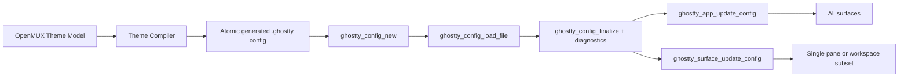

# Runtime Theme Control for OpenMUX with libghostty

## Executive summary

The most robust and maintainable path for OpenMUX is to **own an internal OpenMUX theme model**, compile that model into a **small, deterministic Ghostty-format config file that OpenMUX generates itself**, load it with the **public libghostty C API**, and then apply it at runtime with `ghostty_app_update_config` for global changes or `ghostty_surface_update_config` for pane-specific changes. That path stays inside the public embedding API, avoids reading the user’s Ghostty config, supports live switching without restarting shells, and maps cleanly onto Ghostty’s own runtime reload pipeline, which updates existing surfaces by rebuilding derived config and notifying the renderer and termio layers rather than recreating the terminal process. citeturn25view0turn32view2turn35view0turn38view0

The key architectural constraint is that **the public C API does not expose a “set this color in memory” API**. Today it exposes `ghostty_config_new`, `ghostty_config_clone`, file and CLI config loaders, finalization, getters, diagnostics, and the app/surface update calls, but **no public per-key setters and no public `ghostty_config_load_string`**. That means a truly in-memory setter approach requires a private Zig shim or a fork, which is faster in theory but materially less resilient to upstream change. citeturn25view0turn8view0turn22view0

This recommendation also fits the product direction you described better than CMUX’s current approach. CMUX explicitly says it reads the user’s existing Ghostty config for themes, fonts, and colors, and its `GhosttyConfig.swift` parses Ghostty config and theme files from the standard disk locations. That is reasonable for “Ghostty compatibility,” but it directly conflicts with your stated goals for OpenMUX: no dependence on user Ghostty config files, OpenMUX-owned theming, and predictable runtime control. citeturn40search1turn41view0

## Public API reality

Ghostty’s public embedding header and source give you four things that matter for this decision. First, the public config C API lets you create, clone, free, load-from-file, finalize, inspect, and validate a config object. Second, the public runtime API lets you create an embedded app and surfaces, including macOS surfaces backed by an `NSView`. Third, the public update API lets you re-apply config at the app or surface level at runtime. Fourth, there are public color-scheme callbacks for light/dark state. Those are the official building blocks; there is no public theme injection API beyond them. citeturn25view0turn8view0turn32view2turn32view4turn7view0

The official macOS host uses exactly that model. Ghostty’s own Swift macOS app imports `GhosttyKit`, constructs a `ghostty_runtime_config_s`, creates the embedded app with `ghostty_app_new`, and performs soft reloads by calling `ghostty_app_update_config` or `ghostty_surface_update_config` on the existing config object. In other words, the “runtime update without restart” path is not speculative; it is part of the official host implementation. citeturn43view0turn44view4

The important caution is that the maintainers also state in the header and source comments that this embedding API is **not yet meant as a general-purpose embedding API**, and that documentation largely lives in the Zig implementation. That warning matters for OpenMUX: you should treat libghostty as a powerful but still-evolving dependency, isolate it behind your own adapter, and avoid leaning on private internals unless you absolutely must. citeturn6view0turn22view0

There is also a strong negative signal for JSON-RPC or cross-process theme control. The public C header exposes only a **very small IPC action surface** in that part of the API, and Ghostty’s public macOS automation surface is documented as **AppleScript**, not JSON-RPC theme control. That makes IPC a poor foundation for embedded OpenMUX theming. citeturn18view0turn48search2

Finally, CMUX is a useful contrast case. It says it uses libghostty but reads the existing Ghostty config for themes, fonts, and colors, and its repo includes a `GhosttyConfig.swift` loader/parser with caching by light/dark scheme. That is good repository inspiration for general host structure and caching, but it is the wrong policy for your theming layer if OpenMUX is supposed to own appearance end-to-end. citeturn40search1turn41view0

## Recommended approach

The single best path is:

**OpenMUX theme model → deterministic generated Ghostty config file → `ghostty_config_new` / `ghostty_config_load_file` / `ghostty_config_finalize` → `ghostty_app_update_config` or `ghostty_surface_update_config`**

That path is the best fit because it uses only public API, avoids user config discovery entirely, supports runtime updates for existing surfaces, and keeps OpenMUX’s theme semantics independent from Ghostty’s bundled themes and theme search/load behavior. citeturn25view0turn32view2turn38view0turn16view0turn17view0

It is also more reproducible than using Ghostty theme names directly. Ghostty’s docs say built-in themes are sourced from `iterm2-color-schemes` and updated on the main branch weekly. If OpenMUX wants deterministic visual identity, explicit color emission is a better contract than “theme name X might slightly change underneath us over time.” citeturn16view0

It is more secure and more bounded than pointing Ghostty at arbitrary theme files. Ghostty theme files are just config files, and the docs explicitly say a theme file can set **any valid config option**, not just colors. That is exactly why OpenMUX should normalize everything into its own schema first and then emit only the handful of keys that OpenMUX supports intentionally. citeturn16view0turn17view0

It is also better than relying on Ghostty’s own separate light/dark theme syntax as the primary mechanism. Ghostty supports `theme = light:...,dark:...`, but the docs also note known bugs in light/dark theming on macOS, including titlebar-tabs behavior. Since OpenMUX is building its own AppKit chrome anyway, the cleaner contract is for OpenMUX to decide the active theme variant and then push a concrete terminal config into libghostty. citeturn47view1

The runtime data flow should look like this:



For dark/light integration, there are really two separate concerns. The **actual colors** should come from OpenMUX’s own theme resolver and be applied using `*_update_config`. Separately, if you want Ghostty’s own light/dark conditional state and terminal reporting behavior to stay coherent, you may also call `ghostty_app_set_color_scheme` or `ghostty_surface_set_color_scheme`. Those functions update Ghostty’s color-scheme conditional state and trigger a soft reload path; the official app handles that kind of soft reload by reusing the current config object. In OpenMUX, that should route back into your own cached current-theme application rather than reading disk or a user Ghostty config. citeturn32view2turn32view4turn35view0turn38view1turn44view4

The practical implementation detail that makes this feel “not really file-based” in day-to-day operation is caching. Use the file format as your **public ingestion boundary**, but keep a cache of parsed `ghostty_config_t` objects keyed by a theme hash. The public API gives you `ghostty_config_clone`, diagnostics, and getters, so you can parse once, verify once, cache once, and then reapply cheaply. citeturn25view0turn8view0

## Alternatives and tradeoffs

A private in-memory approach is the most obvious alternative. Because the public C API has no public setters or string loader, this means writing your own Zig/C shim around Ghostty’s internal `Config` type or adding a private export such as `ghostty_config_load_string`. That would remove the file write/parse boundary and could be elegant, but it would be coupled to internal Ghostty code that the maintainers explicitly do not yet frame as a stable, general-purpose embedding surface. citeturn25view0turn22view0

A JSON-RPC or IPC approach is the weakest fit. The public header’s IPC surface is minimal in this area, and the public macOS automation surface Ghostty documents is AppleScript for windows, tabs, and terminal actions, not a JSON-RPC theme-control layer for embedded libghostty. For OpenMUX, that means IPC would add process complexity without giving you a supported per-pane theme API. citeturn18view0turn48search2

A wrapper-process approach is workable only if you intentionally move away from embedding. Ghostty’s embedded runtime is designed for host-controlled `NSView` integration, and the surface config explicitly carries a macOS platform union with an `nsview` pointer. If you instead launch a helper or standalone Ghostty process with config/env/CLI flags, you lose the direct, native, per-surface control that embedding is giving you in the first place. Ghostty’s CLI/config machinery is useful for the standalone app, but it is the wrong abstraction for OpenMUX’s core rendering layer. citeturn30view0turn7view0turn10search11

| Approach | What it really means | Runtime switching | Per-pane or per-workspace themes | Upgrade resilience | Verdict |
| --- | --- | --- | --- | --- | --- |
| In-memory API | Private shim over Ghostty internals; the public C API has loaders/getters but no public setter or `load_string`. citeturn25view0turn8view0 | Excellent | Excellent | Low | Powerful, but higher maintenance |
| Temp generated config file | Generate concrete config text, load with `ghostty_config_load_file`, apply with `ghostty_app_update_config` / `ghostty_surface_update_config`. citeturn25view0turn32view2 | Excellent | Excellent | High | **Recommended** |
| JSON-RPC to libghostty process | Not a public theming surface today; public IPC is minimal, and macOS automation is AppleScript instead. citeturn18view0turn48search2 | Weak | Weak | Medium | Poor fit |
| Wrapper process with env/config | Launch helper/standalone Ghostty using config files or CLI flags, giving up direct embedded `NSView` control. citeturn30view0turn7view0turn10search11 | Medium | Poor | Medium | Only if you abandon embedding |

## Implementation blueprint

The first design rule is simple: **never call** `ghostty_config_load_default_files`, `ghostty_config_load_recursive_files`, or `ghostty_config_load_cli_args` in OpenMUX’s theming pipeline. Those are exactly the public APIs that would pull in user Ghostty config files or process argv. Instead, OpenMUX should build a minimal config file itself and load only that file via `ghostty_config_load_file`. citeturn25view0

The second design rule is to emit **explicit colors**, not theme names. A minimal OpenMUX-owned color config should usually include `background`, `foreground`, `cursor-color`, `cursor-text`, `selection-background`, `selection-foreground`, and `palette` entries for the base ANSI colors. For predictability, keep `palette-generate = false` unless you intentionally want Ghostty to synthesize the extended 256-color palette; Ghostty’s own docs note that many legacy applications assume xterm-like 256-color ordering, which is why automatic generation is off by default. On macOS, if you deliberately support Display P3 themes, `window-colorspace = display-p3` exists, but `srgb` remains the safe default. citeturn17view1turn17view2turn47view1

A practical Swift theme compiler can therefore be very small:

```swift
struct OpenMUXTheme {
    let background: String
    let foreground: String
    let cursorColor: String
    let cursorText: String
    let selectionBackground: String
    let selectionForeground: String
    let ansi16: [String]   // exactly 16 hex colors, index 0...15
    let useDisplayP3: Bool
}

func makeGhosttyConfigText(theme: OpenMUXTheme) -> String {
    precondition(theme.ansi16.count == 16)

    var lines: [String] = [
        "background = \(theme.background)",
        "foreground = \(theme.foreground)",
        "cursor-color = \(theme.cursorColor)",
        "cursor-text = \(theme.cursorText)",
        "selection-background = \(theme.selectionBackground)",
        "selection-foreground = \(theme.selectionForeground)",
        "palette-generate = false",
        "window-colorspace = \(theme.useDisplayP3 ? "display-p3" : "srgb")"
    ]

    for (i, color) in theme.ansi16.enumerated() {
        lines.append("palette = \(i)=\(color)")
    }

    return lines.joined(separator: "\n") + "\n"
}
```

That config text should be written atomically into an OpenMUX-controlled cache directory such as `~/Library/Application Support/OpenMUX/RuntimeThemes/`. In practice, a hashed filename such as `theme-<sha256>.ghostty` works better than ad hoc `/tmp` files because it gives you deterministic caching, easy diagnostics, and straightforward invalidation. This is a synthesis choice, but it follows directly from the public API reality that file loading is the supported ingestion mechanism. citeturn25view0

Then add a tiny C shim so Swift never has to care about config object lifetime details:

```c
// OpenMUXGhosttyBridge.h
#include <ghostty.h>

ghostty_config_t openmux_ghostty_load_config_file(const char *path);
void openmux_ghostty_log_diagnostics(ghostty_config_t cfg);
```

```c
// OpenMUXGhosttyBridge.c
#include "OpenMUXGhosttyBridge.h"
#include <stdio.h>

ghostty_config_t openmux_ghostty_load_config_file(const char *path) {
    ghostty_config_t cfg = ghostty_config_new();
    if (!cfg) return NULL;

    ghostty_config_load_file(cfg, path);
    ghostty_config_finalize(cfg);
    return cfg;
}

void openmux_ghostty_log_diagnostics(ghostty_config_t cfg) {
    uint32_t count = ghostty_config_diagnostics_count(cfg);
    for (uint32_t i = 0; i < count; i++) {
        ghostty_diagnostic_s d = ghostty_config_get_diagnostic(cfg, i);
        if (d.message) fprintf(stderr, "libghostty config diagnostic: %s\n", d.message);
    }
}
```

The public config API supports exactly this lifecycle: create, load file, finalize, inspect diagnostics, then free. citeturn25view0

From Swift, applying a theme becomes straightforward:

```swift
enum ThemeScope {
    case app(ghostty_app_t)
    case surface(ghostty_surface_t)
}

func applyTheme(
    _ theme: OpenMUXTheme,
    scope: ThemeScope,
    cacheURL: URL
) throws {
    let configText = makeGhosttyConfigText(theme: theme)
    try configText.data(using: .utf8)!.write(to: cacheURL, options: .atomic)

    guard let cfg = cacheURL.path.withCString({ openmux_ghostty_load_config_file($0) }) else {
        throw NSError(domain: "OpenMUX", code: 1)
    }
    defer { ghostty_config_free(cfg) }

    openmux_ghostty_log_diagnostics(cfg)

    switch scope {
    case .app(let app):
        ghostty_app_update_config(app, cfg)
    case .surface(let surface):
        ghostty_surface_update_config(surface, cfg)
    }
}
```

For an **app-wide** theme switch, prefer `ghostty_app_update_config`; Ghostty’s core app update path propagates configuration changes across surfaces itself. For **pane-specific** or **workspace-subset** themes, call `ghostty_surface_update_config` only on the affected surfaces. That avoids unnecessary duplicate work and matches the intended app-vs-surface split. citeturn35view0turn32view2

For macOS embedding itself, your surface creation should stay close to the official model: create the embedded app once, then bind surfaces to `NSView` instances through `ghostty_surface_config_s` using the macOS platform branch and an `nsview` pointer. The public API and embedded runtime are clearly designed for this AppKit-hosted pattern. citeturn7view0turn30view0turn43view0

```objective-c
ghostty_surface_config_s scfg = ghostty_surface_config_new();
scfg.platform_tag = GHOSTTY_PLATFORM_MACOS;
scfg.platform.macos.nsview = (__bridge void *)hostView;
scfg.scale_factor = hostView.window.screen.backingScaleFactor ?: NSScreen.mainScreen.backingScaleFactor;
scfg.font_size = 13.0f;

ghostty_surface_t surface = ghostty_surface_new(app, &scfg);
```

If you want the terminal world to know that the ambient color scheme changed, pair your theme application with `ghostty_app_set_color_scheme` or `ghostty_surface_set_color_scheme`. But make your action callback **idempotent** around `.reload_config` with `soft = true`, because Ghostty’s own color-scheme callback path triggers a soft reload request. The official Swift host distinguishes soft reloads from hard reloads and simply reuses the current config for soft updates. OpenMUX should do the same, except its “current config” comes from the OpenMUX theme cache rather than a user Ghostty config path. citeturn32view2turn32view4turn35view0turn38view1turn44view4

```swift
func systemAppearanceDidChange(isDark: Bool, app: ghostty_app_t) throws {
    let scheme = isDark ? GHOSTTY_COLOR_SCHEME_DARK : GHOSTTY_COLOR_SCHEME_LIGHT

    // First, apply OpenMUX's concrete colors.
    try applyTheme(themeForCurrentAppearance(isDark: isDark),
                   scope: .app(app),
                   cacheURL: currentThemeURL())

    // Then, tell Ghostty about light/dark state for its own conditional/reporting behavior.
    ghostty_app_set_color_scheme(app, scheme)
}
```

A final implementation detail is inheritance. `ghostty_app_update_config` is the correct tool for the global default. `ghostty_surface_update_config` is the correct tool for overrides. If a new pane is created inside a workspace that has its own theme, do not assume Ghostty will infer that from its generic inherited surface options; apply the workspace theme explicitly as part of your pane creation flow. That keeps “theme ownership” in OpenMUX where it belongs. citeturn32view2turn8view0

## Testing compatibility and risk

Your unit tests should treat the generated config text as a product artifact. Load it with `ghostty_config_new`, `ghostty_config_load_file`, and `ghostty_config_finalize`, then assert that `ghostty_config_diagnostics_count` is zero and that `ghostty_config_get` returns the expected values for keys such as `background`, `foreground`, and `window-colorspace`. That gives you a stable contract test at the public API boundary. citeturn25view0

Your integration tests should create a real embedded app plus one or more hidden AppKit-hosted surfaces, apply an app-wide theme, then apply a pane-specific override, and verify that the surfaces keep running. Because the public API exposes terminal process information such as the foreground PID and whether the surface process exited, you can build a “theme switch must not restart the shell” test around those APIs. The core runtime update path also strongly suggests this should hold, because config reload sends change messages into renderer and termio rather than reinitializing the surface itself. citeturn8view0turn38view0

Your manual regression checklist should include at least five scenarios. One is rapid global theme toggling with multiple panes. Another is per-pane theme overrides inside the same window. Another is dark/light switching from macOS appearance changes. Another is creation of new splits or panes after a workspace override has been set. The last one is OSC color interaction, because Ghostty has historically had bugs around config reload overriding colors changed by OSC 10/11/12; even if that specific bug was fixed, it is exactly the kind of area where OpenMUX should keep a regression test. citeturn39view0

Compatibility strategy matters as much as runtime behavior. The safest posture is to **pin libghostty to a known commit or release**, wrap all direct C API calls behind an `OpenMUXGhosttyAdapter`, and run contract tests on every upgrade. That recommendation is not abstract paranoia: the public embedding API is explicitly presented as still evolving, and there has even been a recent header/implementation mismatch issue in the C API surface. citeturn22view0turn27search8

The short risk table below captures the main operational issues:

| Risk | Why it exists | Mitigation |
| --- | --- | --- |
| API drift | The embedding API is explicitly still evolving, and docs live largely in source. citeturn22view0turn6view0 | Pin versions, isolate libghostty behind an adapter, and keep public-API contract tests |
| Theme scope creep | Ghostty theme files can set any config option, not just colors. citeturn16view0turn17view0 | Normalize imported themes into an OpenMUX schema and emit only approved keys |
| Reload loops | `*_set_color_scheme` triggers Ghostty’s soft reload path. citeturn35view0turn38view1 | Make reload handling idempotent and route soft reloads to cached current-theme reapply |
| Unnecessary work | App-wide changes can fan out across surfaces. citeturn35view0 | Use `ghostty_app_update_config` for global changes, `ghostty_surface_update_config` only for true overrides |
| Theme reproducibility | Built-in Ghostty themes are sourced externally and updated over time. citeturn16view0 | Prefer explicit emitted colors over theme-name references |
| Terminal app color regressions | OSC/config interactions have historically been a bug surface. citeturn39view0 | Keep explicit regression tests for OSC 10/11/12 and theme switching |

The compatibility migration story is actually favorable if you choose the recommended path now. If Ghostty later adds a public `load_string` API or public per-key setters, you can swap the backend of your theme compiler from “write file then load” to “load from string” without changing the OpenMUX theme model, the cache policy, or the rest of your UI architecture. That is exactly why the file-based public API boundary is the right place to anchor OpenMUX today. citeturn25view0turn22view0