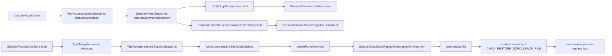
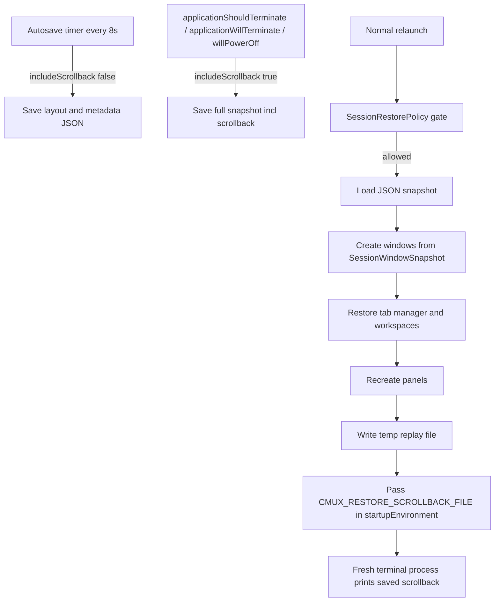

# CMUX Scrollback Persistence and Adapting It to OpenMUX

## Executive summary

CMUX does **not** appear to persist libghostty terminal state natively. Instead, it uses a higher-level, app-managed restore system built from three pieces: a JSON session snapshot (`AppSessionSnapshot` and related `Codable` structs), a terminal-text capture step at snapshot time, and a restore-time **scrollback replay** mechanism that writes saved text to a temporary file and passes its path into newly created terminal panels through the environment variable `CMUX_RESTORE_SCROLLBACK_FILE`. The JSON snapshot is stored under Application Support, while replay files are written under the system temporary directory. citeturn7view1turn7view2turn6view0turn52view3

The terminal-history part is therefore a **best-effort replay strategy**, not a true VM-like restoration of PTY or libghostty internal state. CMUX’s own README says it restores “Terminal scrollback (best effort)” and explicitly says it does **not** restore arbitrary live terminal process state; issue #2016 also notes that native scrollback persistence is not available upstream in libghostty. citeturn14view1turn46view2

For save timing, the most important facts are: CMUX defines an autosave interval of **8 seconds** in `SessionPersistencePolicy`, but a March 2026 issue documents that the autosave path saves **layout only** with `includeScrollback: false`; full scrollback persistence happens on clean termination paths such as `applicationShouldTerminate` and `willPowerOff`. AppDelegate comments also confirm that a full snapshot with scrollback is already persisted during termination, and that later window-unregister saves use `includeScrollback: false`. citeturn7view4turn46view0turn56view0turn58view2

For OpenMUX, the cleanest adaptation is to port the **same architectural idea**, not to chase a libghostty-private serialisation format. OpenMUX already has a modular package split between `OmuxCore`, `OmuxTerminalBridge`, `OmuxAppShell`, `OmuxControlPlane`, and `OmuxHooks`, and it vendors GhosttyKit behind a narrow bridge. That structure is actually favourable: put the snapshot schema and file store in `OmuxCore`, put save/restore orchestration in `OmuxAppShell`, and put terminal text capture plus startup-environment plumbing in `OmuxTerminalBridge`. citeturn22view0turn23view0turn16view2

Primary source files most relevant to this report are: CMUX [`Sources/SessionPersistence.swift`](https://github.com/manaflow-ai/cmux/blob/main/Sources/SessionPersistence.swift), [`Sources/Workspace.swift`](https://github.com/manaflow-ai/cmux/blob/main/Sources/Workspace.swift), [`Sources/AppDelegate.swift`](https://github.com/manaflow-ai/cmux/blob/main/Sources/AppDelegate.swift), and the CMUX [`README.md`](https://github.com/manaflow-ai/cmux); and for OpenMUX, [`Package.swift`](https://github.com/finger-gun/omux/blob/main/Package.swift), the root repo page, and the [`Sources/`](https://github.com/finger-gun/omux/tree/main/Sources) tree. The citations below point to the exact extracted passages used from those sources. citeturn14view1turn7view1turn52view3turn60view1turn22view0turn23view0turn16view1

## What CMUX actually implements

CMUX’s persistence model is codified in `Sources/SessionPersistence.swift`. That file defines the snapshot schema root `AppSessionSnapshot`, plus nested types for windows, tab managers, workspaces, layouts, panes, terminal panels, browser panels, sidebar state, status/log/progress metadata, and more. The terminal-specific payload is `SessionTerminalPanelSnapshot`, which carries `workingDirectory` and `scrollback`. At the file-store level, `SessionPersistenceStore` loads and saves JSON snapshots, validates `version`, and uses `JSONEncoder`/`JSONDecoder`. citeturn6view0turn7view1

The on-disk format is a **sorted-key JSON file** in the user’s Application Support directory, under a `cmux` subdirectory. The default file name pattern is `session-<bundle-id>.json`; there is also a **manual-restore cache** stored separately as `session-<bundle-id>-previous.json`, exposed through `loadReopenSessionSnapshot`, `manualRestoreSnapshotFileURL`, and `syncManualRestoreSnapshotCache()`. That second file matters because CMUX’s UI and CLI expose “Reopen Previous Session” semantics in addition to normal launch restore. citeturn7view1turn14view1

The scrollback replay mechanism is a separate store, `SessionScrollbackReplayStore`. It normalises optional terminal text, truncates it through `SessionPersistencePolicy.truncatedScrollback`, wraps ANSI state safely with reset codes when needed, writes a temporary text file into `FileManager.default.temporaryDirectory/cmux-session-scrollback`, and returns a tiny environment dictionary containing `CMUX_RESTORE_SCROLLBACK_FILE=<path>`. There is no evidence in the cited code that this temp file is deleted immediately after use; the store’s job is only to create it and hand the path to the child environment. citeturn7view2turn6view0

The key practical implication is that CMUX’s “restore scrollback” is **replay into a fresh terminal process**, not libghostty internal-buffer hydration. That matches both the README’s “best effort” wording and issue #2016, which explicitly attributes the lack of native scrollback persistence to libghostty upstream. citeturn14view1turn46view2

Within `Workspace.swift`, the save path is very clear. `Workspace.sessionSnapshot(includeScrollback:)` walks the live Bonsplit tree, records layout and metadata, and calls `sessionPanelSnapshot(panelId:includeScrollback:)` for each panel. For terminal panels, that method checks `terminalPanel.shouldPersistScrollbackForSessionSnapshot()`, then calls `TerminalController.shared.readTerminalTextForSnapshot(terminalPanel:includeScrollback:lineLimit:)`, with the line limit set from `SessionPersistencePolicy.maxScrollbackLinesPerTerminal`. The resulting text is then resolved through `terminalSnapshotScrollback(...)`, which can also fall back to previously restored scrollback kept in memory in `restoredTerminalScrollbackByPanelId`. citeturn54view0turn52view3turn7view3

On restore, `Workspace.restoreSessionSnapshot(_:)` rebuilds the split tree, remaps old panel IDs to new ones, recreates terminal/browser/markdown panels, reapplies metadata, and for terminal panels calls `createPanel(from:inPane:)`. In the terminal branch of that method, CMUX computes `replayEnvironment = SessionScrollbackReplayStore.replayEnvironment(for: snapshot.terminal?.scrollback)` and passes it into `newTerminalSurface(... startupEnvironment: replayEnvironment)`. It also stores a truncated fallback copy of the same scrollback in `restoredTerminalScrollbackByPanelId`, so later snapshots can preserve history even if direct capture fails. citeturn54view0turn52view3



The diagram above is a direct synthesis of the snapshot store, workspace save/restore methods, and replay-store environment mechanism visible in CMUX’s cited sources. citeturn7view1turn7view2turn54view0turn52view3turn60view1

## Save and restore lifecycle in CMUX

The practical session boundary in CMUX is: **application → window → tab manager → workspace → layout tree → panel**. `AppSessionSnapshot` contains `windows`; each `SessionWindowSnapshot` contains a `SessionTabManagerSnapshot` and sidebar state; each tab manager snapshot contains workspaces; each workspace snapshot contains layout, panels, and metadata; and terminal panels can carry `workingDirectory` and `scrollback`. citeturn6view0turn7view1

For scheduling and triggers, there are two distinct save modes. First, there is a regular autosave cadence: `SessionPersistencePolicy.autosaveInterval = 8.0`. Second, there are full-save termination paths: issue #1340 states that “scrollback is only persisted on clean termination (`applicationShouldTerminate`, `willPowerOff`)” while the autosave timer passes `includeScrollback: false`. AppDelegate comments in the current source align with that: during termination, a “full snapshot (with scrollback)” has already been persisted, and later window-unregister logic does only `saveSessionSnapshot(includeScrollback: false, ...)` to avoid overwriting the full save while windows tear down. citeturn7view4turn46view0turn56view0turn58view2

That means CMUX intentionally optimises for **fast, frequent layout durability** but **low-frequency scrollback durability**. It avoids re-reading terminal history every 8 seconds, presumably because scrollback capture is more expensive and more volatile than recording window/workspace structure. The upside is lower periodic overhead; the downside is that a crash or force-kill can lose all scrollback produced since the last clean termination. That limitation is precisely what issue #1340 calls out. citeturn46view0turn7view3

Launch restore is guarded by `SessionRestorePolicy.shouldAttemptRestore(...)`, which disables automatic restore in several test-related environments and when the process receives explicit launch arguments; the policy comment says any explicit launch argument is treated as an explicit open intent. Separately, `AppDelegate.createMainWindow(initialWorkingDirectory:sessionWindowSnapshot:)` clearly accepts a preloaded `SessionWindowSnapshot` and applies it by restoring the tab manager snapshot, sidebar visibility/selection/width, and the window frame. The exact top-level AppDelegate call site that loads the JSON and iterates `snapshot.windows` was not fully recoverable in this browsing session, but the available evidence is strong enough to establish the restore pipeline components and their relationship. citeturn6view0turn60view1

The restore itself is deliberately **panel-type aware**. Browser panels restore current URL, back/forward history, zoom, and developer-tools visibility; markdown panels restore file path; terminal panels restore working directory and scrollback replay environment. That design matters for OpenMUX, because it suggests you should not bolt scrollback persistence onto the terminal bridge alone; it belongs in a broader session framework that understands panes, layouts, and non-terminal content as first-class state. citeturn52view3



This flowchart condenses the cited autosave policy, termination behaviour, restore gating, and replay-environment plumbing. citeturn46view0turn56view0turn58view2turn6view0turn60view1turn52view3

## CMUX and OpenMUX compared

| Concern | CMUX | OpenMUX | Porting consequence |
|---|---|---|---|
| Persistence model | Confirmed session schema in `SessionPersistence.swift`: `AppSessionSnapshot`, window/workspace/layout/panel snapshots, JSON load/save store, and a separate replay-file store. citeturn6view0turn7view1turn7view2 | No confirmed equivalent persistence module surfaced in the browsed OpenMUX tree; confirmed module boundaries are `OmuxCore`, `OmuxTerminalBridge`, `OmuxAppShell`, `OmuxControlPlane`, `OmuxHooks`, etc. citeturn23view0turn22view0 | Implement the schema and store in **OmuxCore** first, rather than mixing it into view code. |
| Terminal history capture | Confirmed save call site in `Workspace.sessionPanelSnapshot(...)`: `TerminalController.shared.readTerminalTextForSnapshot(..., includeScrollback: true, lineLimit: ...)`, gated by `shouldPersistScrollbackForSessionSnapshot()`. citeturn52view3turn7view3 | OpenMUX README confirms “persistent interactive shell sessions” and a narrow Ghostty bridge, but no confirmed history-capture API was visible in browsed sources. citeturn16view2turn22view0 | Add a **terminal snapshot reader** interface in `OmuxTerminalBridge`; if a direct Ghostty text-export hook is unavailable, mirror CMUX’s higher-level replay approach. |
| Restore hook | Confirmed restore call site in `Workspace.createPanel(from:inPane:)`: CMUX builds `replayEnvironment` and passes it to `newTerminalSurface(... startupEnvironment: replayEnvironment)`. citeturn52view3 | OpenMUX vendors GhosttyKit and isolates terminal hosting in `OmuxTerminalBridge`. citeturn22view0turn16view2 | Add a **startup environment** field to the OpenMUX terminal-launch path and inject replay file paths there. |
| Save triggers | Autosave interval is 8 seconds, but issue #1340 documents that autosave omits scrollback; clean termination persists full snapshot with scrollback. citeturn7view4turn46view0turn56view0turn58view2 | No confirmed equivalent triggers were visible in browsed OpenMUX sources. citeturn23view0turn16view1 | For parity, implement **fast layout autosave** plus **full save on quit/power-off**. For improved crash durability, add a slower scrollback-inclusive timer. |
| Storage | Application Support JSON (`session-<bundle>.json`, `-previous.json`) plus temp replay text files under a `cmux-session-scrollback` directory. No DB required. citeturn7view1turn7view2 | OpenMUX package and README show no existing persistence DB requirement for this feature. citeturn22view0turn16view2 | Reuse the same low-complexity storage model in OpenMUX: JSON + temp files. |
| App architecture | CMUX mixes AppKit/SwiftUI app orchestration with terminal/workspace logic, but the persistence join points are clearly visible in `AppDelegate` and `Workspace`. README also states it is native macOS Swift/AppKit and Ghostty-based. citeturn14view1turn60view1turn52view3 | OpenMUX is also native macOS, but its package graph is more modular, separating shell/UI/core/bridge/control-plane/hook concerns. citeturn22view0turn16view2 | OpenMUX should produce a **cleaner port** than CMUX: coordinator in app shell, schema in core, bridge in terminal layer. |
| Testing surface | CMUX has explicit automated-test restore gating in `SessionRestorePolicy`. citeturn6view0 | OpenMUX already declares test targets for `OmuxCore`, `OmuxTerminalBridge`, `OmuxAppShell`, `OmuxControlPlane`, and more. citeturn6view1turn22view0 | OpenMUX is well-positioned to add **unit tests + integration tests** around roundtrips and launch restore. |

A final architectural nuance matters here: libghostty itself is an embeddable terminal library with a multi-threaded architecture and dedicated read/write/render threads per terminal, but CMUX’s session-history feature is implemented **above** that layer, not as libghostty internal state serialisation. That makes a like-for-like OpenMUX port realistic even if Ghostty upstream never adds native scrollback persistence. citeturn19search0turn46view2

## Proposed OpenMUX patch outline

The most robust OpenMUX port is to recreate the **CMUX contract**, not the exact CMUX file layout. Because the OpenMUX package structure is confirmed but many individual source filenames were not retrievable in this browsing session, the **target placement below is high-confidence**, while some exact file names are **proposed** rather than confirmed. citeturn22view0turn23view0turn16view2

### Add a core snapshot schema and file store

Create a new file such as `Sources/OmuxCore/SessionPersistence.swift` with Codable snapshot types matching OpenMUX’s own model: app session, windows, workspaces/tabs, pane tree, pane metadata, terminal payload, and optional browser/other panel payloads if relevant.

```swift
import Foundation

public enum OmuxSessionSchema {
    public static let currentVersion = 1
}

public struct OmuxTerminalPaneSnapshot: Codable, Sendable, Equatable {
    public var workingDirectory: String?
    public var scrollback: String?
}

public struct OmuxPaneSnapshot: Codable, Sendable, Equatable {
    public var id: UUID
    public var kind: String
    public var title: String?
    public var terminal: OmuxTerminalPaneSnapshot?
}

public indirect enum OmuxLayoutSnapshot: Codable, Sendable, Equatable {
    case leaf(paneIDs: [UUID], selectedPaneID: UUID?)
    case split(orientation: String, dividerPosition: Double, first: OmuxLayoutSnapshot, second: OmuxLayoutSnapshot)
}

public struct OmuxWorkspaceSnapshot: Codable, Sendable, Equatable {
    public var id: UUID
    public var title: String
    public var currentDirectory: String
    public var focusedPaneID: UUID?
    public var layout: OmuxLayoutSnapshot
    public var panes: [OmuxPaneSnapshot]
}

public struct OmuxWindowSnapshot: Codable, Sendable, Equatable {
    public var id: UUID
    public var frame: CGRectCodable?
    public var workspaces: [OmuxWorkspaceSnapshot]
    public var selectedWorkspaceIndex: Int?
}

public struct OmuxAppSessionSnapshot: Codable, Sendable, Equatable {
    public var version: Int
    public var createdAt: TimeInterval
    public var windows: [OmuxWindowSnapshot]
}

public enum OmuxSessionStore {
    public static func defaultURL(bundleID: String) -> URL? {
        FileManager.default.urls(for: .applicationSupportDirectory, in: .userDomainMask)
            .first?
            .appendingPathComponent("openmux", isDirectory: true)
            .appendingPathComponent("session-\(bundleID).json", isDirectory: false)
    }

    @discardableResult
    public static func save(_ snapshot: OmuxAppSessionSnapshot, to url: URL) -> Bool {
        do {
            try FileManager.default.createDirectory(
                at: url.deletingLastPathComponent(),
                withIntermediateDirectories: true
            )
            let encoder = JSONEncoder()
            encoder.outputFormatting = [.sortedKeys]
            let data = try encoder.encode(snapshot)
            try data.write(to: url, options: .atomic)
            return true
        } catch {
            return false
        }
    }

    public static func load(from url: URL) -> OmuxAppSessionSnapshot? {
        guard
            let data = try? Data(contentsOf: url),
            let snapshot = try? JSONDecoder().decode(OmuxAppSessionSnapshot.self, from: data),
            snapshot.version == OmuxSessionSchema.currentVersion
        else { return nil }
        return snapshot
    }
}
```

This mirrors CMUX’s confirmed use of `Codable` snapshots, sorted-key JSON, Application Support storage, and versioned schema, but expresses it in OpenMUX’s modular core target. citeturn7view1turn6view0turn22view0

### Add a replay-file helper in the terminal layer

Create `Sources/OmuxTerminalBridge/ScrollbackReplayStore.swift`. The behaviour should intentionally match CMUX: cap scrollback size, avoid truncating into the middle of ANSI control sequences, write a temp text file, and pass its path via an env var.

```swift
import Foundation

public enum OmuxScrollbackReplayStore {
    public static let environmentKey = "OMUX_RESTORE_SCROLLBACK_FILE"
    private static let directoryName = "openmux-session-scrollback"
    private static let maxChars = 400_000

    public static func replayEnvironment(for scrollback: String?) -> [String: String] {
        guard let scrollback, !scrollback.trimmingCharacters(in: .whitespacesAndNewlines).isEmpty else {
            return [:]
        }

        let text = truncateANSI(scrollback, maxChars: maxChars)
        guard let url = writeReplayFile(text: text) else { return [:] }
        return [environmentKey: url.path]
    }

    private static func writeReplayFile(text: String) -> URL? {
        let dir = FileManager.default.temporaryDirectory
            .appendingPathComponent(directoryName, isDirectory: true)
        let url = dir.appendingPathComponent(UUID().uuidString).appendingPathExtension("txt")

        do {
            try FileManager.default.createDirectory(at: dir, withIntermediateDirectories: true)
            try text.data(using: .utf8)?.write(to: url, options: .atomic)
            return url
        } catch {
            return nil
        }
    }

    private static func truncateANSI(_ input: String, maxChars: Int) -> String {
        if input.count <= maxChars { return input }
        let start = input.index(input.endIndex, offsetBy: -maxChars)
        return String(input[start...]) // refine with ANSI-safe boundary logic
    }
}
```

CMUX uses the same basic mechanism under `SessionScrollbackReplayStore`, with `CMUX_RESTORE_SCROLLBACK_FILE` and a temp subdirectory named `cmux-session-scrollback`. citeturn7view2turn6view0

### Add a terminal snapshot reader interface

OpenMUX will need a bridge-facing reader equivalent to CMUX’s `TerminalController.shared.readTerminalTextForSnapshot(...)`. If your current Ghostty bridge already has some text-extraction or host-side buffer mirror, wrap it. If not, add a dedicated abstraction and implement it at the narrowest point where the bridge still has enough terminal access.

```swift
public protocol OmuxTerminalSnapshotReadable: Sendable {
    func readText(
        paneID: UUID,
        includeScrollback: Bool,
        lineLimit: Int
    ) -> String?
}
```

Then inject it into session-save orchestration:

```swift
func makeTerminalPaneSnapshot(
    pane: TerminalPane,
    reader: OmuxTerminalSnapshotReadable,
    includeScrollback: Bool
) -> OmuxPaneSnapshot {
    let captured: String? = includeScrollback
        ? reader.readText(
            paneID: pane.id,
            includeScrollback: true,
            lineLimit: 4_000
          )
        : nil

    return OmuxPaneSnapshot(
        id: pane.id,
        kind: "terminal",
        title: pane.title,
        terminal: .init(
            workingDirectory: pane.currentWorkingDirectory,
            scrollback: captured
        )
    )
}
```

The analogous, confirmed CMUX read hook is the `Workspace.sessionPanelSnapshot(...)` call into `TerminalController.shared.readTerminalTextForSnapshot(...)` with a scrollback line limit. citeturn52view3turn7view3

### Plumb startup environment through terminal creation

In `OmuxTerminalBridge` or whichever factory creates terminal panes, add a startup-environment parameter. This is the crucial restore hook.

```swift
public struct OmuxTerminalLaunchOptions: Sendable {
    public var workingDirectory: String?
    public var environment: [String: String]
    public var initialCommand: String?

    public init(
        workingDirectory: String? = nil,
        environment: [String: String] = [:],
        initialCommand: String? = nil
    ) {
        self.workingDirectory = workingDirectory
        self.environment = environment
        self.initialCommand = initialCommand
    }
}
```

Then restore like this:

```swift
let env = OmuxScrollbackReplayStore.replayEnvironment(
    for: snapshot.terminal?.scrollback
)

let options = OmuxTerminalLaunchOptions(
    workingDirectory: snapshot.terminal?.workingDirectory ?? snapshotFallbackDirectory,
    environment: env
)

let paneID = terminalFactory.createTerminalPane(options: options)
```

This is the part of CMUX that is most directly reusable conceptually: `Workspace.createPanel(from:inPane:)` constructs `replayEnvironment` and passes it as `startupEnvironment` when creating the new terminal surface. citeturn52view3

### Add save and restore orchestration in the app shell

A new app-shell coordinator should own the lifecycle policy. For parity with CMUX, implement:

1. **Layout-only autosave** on a short timer.
2. **Full save including scrollback** on quit / termination.
3. **Optional power-off/log-out save** via `NSWorkspace` notification.
4. Startup restore only when launch intent is plain app relaunch, not explicit “open file / command” intent.

```swift
final class OmuxSessionCoordinator {
    private var autosaveTimer: Timer?
    private let terminalReader: OmuxTerminalSnapshotReadable
    private let bundleID: String

    init(terminalReader: OmuxTerminalSnapshotReadable, bundleID: String) {
        self.terminalReader = terminalReader
        self.bundleID = bundleID
    }

    func startAutosave(appModel: OmuxAppModel) {
        autosaveTimer = Timer.scheduledTimer(withTimeInterval: 8.0, repeats: true) { [weak self] _ in
            self?.save(appModel: appModel, includeScrollback: false)
        }
    }

    @discardableResult
    func save(appModel: OmuxAppModel, includeScrollback: Bool) -> Bool {
        guard let url = OmuxSessionStore.defaultURL(bundleID: bundleID) else { return false }
        let snapshot = appModel.makeSessionSnapshot(
            includeScrollback: includeScrollback,
            terminalReader: terminalReader
        )
        return OmuxSessionStore.save(snapshot, to: url)
    }

    func restoreIfAppropriate(appModel: OmuxAppModel, arguments: [String], environment: [String: String]) {
        guard arguments.dropFirst().isEmpty else { return }
        guard environment["OMUX_DISABLE_SESSION_RESTORE"] != "1" else { return }
        guard let url = OmuxSessionStore.defaultURL(bundleID: bundleID),
              let snapshot = OmuxSessionStore.load(from: url)
        else { return }

        appModel.restore(from: snapshot)
    }
}
```

CMUX confirms the same broad split: a restore gate (`SessionRestorePolicy.shouldAttemptRestore`), a short autosave interval in policy, and full-save handling during termination-windows. citeturn6view0turn7view4turn46view0turn56view0

### Prefer a slightly improved OpenMUX policy

If you want **strict CMUX parity**, keep scrollback persistence on clean quit only. If you want the better operational behaviour that CMUX users themselves are now requesting, add a second slower timer for scrollback-inclusive snapshots, for example every 5–15 minutes. That exactly addresses the durability gap documented in CMUX issue #1340 while preserving a cheap 8-second layout autosave. citeturn46view0turn7view4

### Add tests before wiring UI shortcuts and CLI affordances

OpenMUX already has test targets across core, bridge, shell, control plane, CLI, hooks, and theme/config targets, so you have a natural home for both unit-level and integration-level tests. citeturn6view1turn22view0

Recommended test set:

1. **Round-trip schema tests** in `OmuxCoreTests`: encode/decode deep split trees, multiple windows, pane-local tabs, working directories, and browser payloads.
2. **Truncation tests** in `OmuxTerminalBridgeTests`: big scrollback, ANSI prefix/suffix safety, empty/whitespace-only buffers.
3. **Replay-file tests**: temp file created, env var emitted, invalid UTF-8/write failures return empty env.
4. **Restore tests** in `OmuxAppShellTests`: snapshot boot reconstructs windows/workspaces/panes and injects `OMUX_RESTORE_SCROLLBACK_FILE`.
5. **Crash-durability test** if you add periodic scrollback saves: create history, trigger slow-scrollback save, simulate hard relaunch, verify last persisted history appears.
6. **Security tests**: snapshot path sanitisation by bundle identifier and explicit cleanup/removal of obsolete replay files.

## Effort, risks and open questions

A realistic estimate for an OpenMUX MVP is **about one engineering week** if your bridge already has a usable text-export path. A sensible split would be: schema/store and app-shell coordinator in 1–2 days, bridge environment plumbing in 1 day, terminal text reader in 1–2 days, then tests and bug-fixing in 1–2 days. If the bridge **does not** already expose enough terminal text to implement `readText(...)`, add another 2–4 days for either bridge extension or a host-side mirrored-history mechanism. This estimate is an engineering judgement, not a repository-stated number.

The main technical risk is exactly the one CMUX documents: because libghostty does not natively persist scrollback, replay is inherently approximate. It restores visible history context well, but it does **not** recreate process state, alternate-screen internals, scroll position nuances, or application-resident UI state in programs such as `vim`, `less`, or full-screen TUIs. CMUX’s own README is explicit on that point. citeturn46view2turn14view1

The main operational risk is **data sensitivity**. CMUX’s current code writes snapshot JSON and temp replay files using default directory creation and atomic writes, but the cited code does not show explicit restrictive POSIX permissions or guaranteed temp-file cleanup. For OpenMUX, I would treat that as a deliberate improvement point: create the snapshot directory with user-only permissions where possible, redact or opt out of saving sensitive panes, and delete replay files after first successful consumption. citeturn7view1turn7view2

The main architectural risk on the OpenMUX side is incomplete source visibility in this research session. I could confirm the package topology, GhosttyKit vendoring, the bridge target, and the app-shell/control-plane split, but I could **not** reliably fetch all of the deeper OpenMUX source files from GitHub through the browser tooling. So the **target-level integration points** in this report are high-confidence, while some **exact OpenMUX filenames** in the patch outline are proposed names rather than confirmed existing files. citeturn22view0turn23view0turn16view1

The two most important unresolved questions for implementation are therefore straightforward:

- Does `OmuxTerminalBridge` already expose a safe, bounded “read terminal text including scrollback” API, or will you need to add one?
- Where, in the current OpenMUX app-shell boot path, is the cleanest single point to decide “restore previous session vs explicit open intent”?

Those are the only material unknowns blocking a concrete code patch. Everything else in CMUX’s design is sufficiently clear to port now.