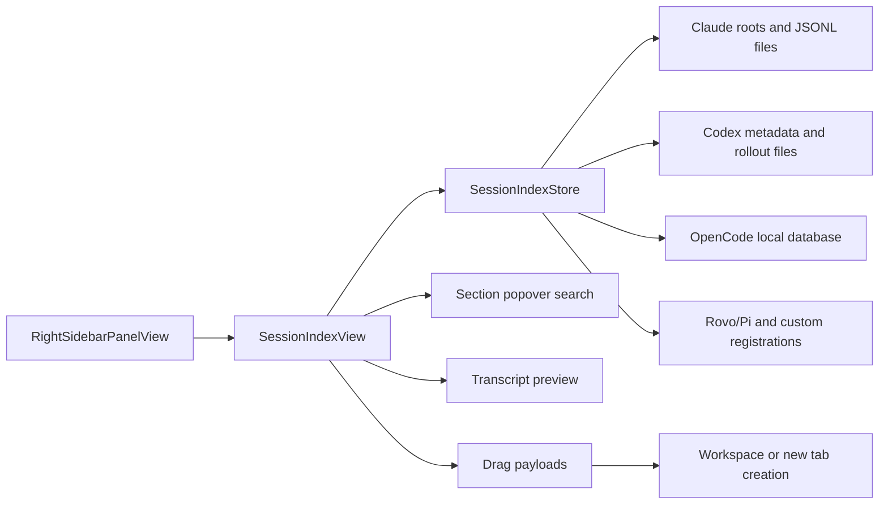
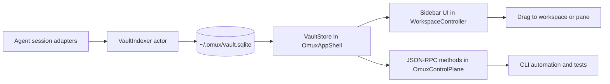

# cmux Vault Implementation and OpenMUX Adaptation Report

## Executive summary

cmux’s Vault is not implemented as a separate service. It is a tightly-coupled desktop feature built around three main app-layer files: `Sources/RightSidebarPanelView.swift` for routing the right sidebar into Vault mode, `Sources/SessionIndexView.swift` for the Vault UI and interaction model, and `Sources/SessionIndexStore.swift` for loading, grouping, caching, and searching session entries. Session restoration is handled by the adjacent restoration model in `Sources/RestorableAgentSession.swift` and `Sources/RestorableAgentTypes.swift`. The feature first landed as a “Sessions” sidebar on **April 17, 2026** in commit `b4efe38`, was renamed to **Vault** on **May 5, 2026** in commit `24aba0f`, gained Codex transcript search on **May 1, 2026** in `6e69f2c`, gained Rovo Dev support on **May 5, 2026** in `e9b1f8c`, and gained Pi restore support on **May 7, 2026** in `744521d`. citeturn41view0turn41view1turn41view4turn42view2turn41view5turn42view0turn15view0turn16view1

Architecturally, Vault is a local-first, single-user feature. cmux reads session artifacts directly from agent-owned local stores such as Claude JSONL transcripts, Codex session data, and OpenCode’s local database; it persists only Vault presentation state such as grouping and section order in `UserDefaults`. Search is implemented inside the Vault store rather than through a standalone search backend. The current code shows bounded scanning and caching behavior, plus a Codex-specific SQL helper introduced in `SessionIndexStore+CodexSQL.swift`, but I did **not** find evidence in the inspected Vault paths of a unified external search engine or a dedicated Vault-specific encrypted store. citeturn41view0turn18view1turn19view9turn32view3turn32view4turn42view2turn43view1turn43view3

The most important implementation idea to carry into OpenMUX is **not** “copy the file format readers byte-for-byte.” It is the combination of: a bounded local index/store, a right-sidebar mode switch, a low-invalidation UI that avoids broad observable subscriptions, a resumable session model, and drag/drop payloads that resolve into workspace actions. OpenMUX already has the right substrate for this: a native macOS app shell, persistent shell sessions, workspace persistence, and a local JSON-RPC control plane over a Unix socket. The cleanest OpenMUX adaptation is therefore to add a dedicated `Vault` subsystem that plugs into `OmuxAppShell` for UI, `OmuxControlPlane` for automation, and the existing persistence/controller layer for resume actions. citeturn44view0turn45view0turn47view0turn48view0

Because GitHub browsing exposed OpenMUX’s module and file layout clearly but did not expose the internals of every OpenMUX file in this session, the OpenMUX file mapping below is **precise at the module/file level** but some per-file responsibilities are necessarily inferred from filenames and repository structure. I call those inferences out where relevant. citeturn45view0turn47view0turn47view1turn48view0

## cmux Vault implementation inventory

The core implementation footprint is surprisingly compact for the user-visible feature set. The right sidebar router selects Vault mode and embeds `SessionIndexView`; `SessionIndexView` owns the interaction model, drag state isolation, grouping controls, section popovers, and transcript previews; `SessionIndexStore` owns scanning, search, grouping caches, directory snapshots, and persisted presentation state. Restoration is modeled separately via `SessionRestorableAgentSnapshot` and related agent kind/registration code. citeturn4view2turn18view0turn32view1turn22view4turn23view0turn23view1

| cmux file or commit | What it implements | Evidence |
|---|---|---|
| `Sources/RightSidebarPanelView.swift` | Right-sidebar mode routing into Vault via `SessionIndexView`, including the `.sessions` mode that later became Vault. | `case .sessions: SessionIndexView(...)` and related mode wiring. citeturn4view2turn4view1 |
| `Sources/SessionIndexView.swift` | Vault UI: control bar, grouping buttons, “This folder only” filter, section rendering, show-more popover host, drag/drop, row preview, transcript preview virtualization. | Current file lines across controls, list rendering, popover closures, drag/drop, previews, and transcript virtualization. citeturn24view5turn24view6turn27view0turn27view1turn35view0turn28view1turn28view3turn26view6turn27view5turn27view6 |
| `Sources/SessionIndexStore.swift` | Vault store: `entries`, loading state, current-directory scoping, grouping, order persistence, reload task, directory snapshot cache, scan limits, bounded file reads. | Store fields, `reload()`, cache, limits, and scanning constants. citeturn18view0turn18view1turn32view3turn32view4turn32view5 |
| `Sources/RestorableAgentSession.swift` | Resume/fork command construction and persisted restoration snapshot for agent sessions. | `SessionRestorableAgentSnapshot` with `kind`, `sessionId`, `workingDirectory`, `launchCommand`, optional registration, and computed `resumeCommand`. citeturn22view4 |
| `Sources/RestorableAgentTypes.swift` | Agent kind enumeration, including built-ins and custom registrations used by Vault restore. | `RestorableAgentKind` and raw values such as `claude`, `codex`, `pi`, `gemini`, `opencode`, `rovodev`, plus custom registration fallback. citeturn23view0turn23view1turn23view3 |
| Commit `b4efe38` | Initial Sessions sidebar launch: sources, grouping, drag reorder, folder filter, resume workflow. | Commit description enumerates sources, grouping modes, persisted keys, and resume path. citeturn41view0turn41view1 |
| Commit `6fe581e` | CPU-loop fix in the sessions panel path. | Commit title and changed files on `ContentView`, `SessionIndexStore`, and `SessionIndexView`. citeturn41view2turn31search2 |
| Commit `914a5ca` | Virtualization and drag-state isolation improvements. | File history records “Keep LazyVStack virtualization; isolate drag state + Equatable row snapshots.” citeturn15view0turn16view1 |
| Commit `a34eb1f` | Search focus and transcript preview hardening; current Vault UX reflects these changes. | Commit description explicitly mentions restoring search focus and hardening transcript previews. citeturn41view3 |
| Commit `6e69f2c` | Codex transcript/content search and SQL helper split into `SessionIndexStore+CodexSQL.swift`. | Commit title, file list, and SQL helper file diff. citeturn42view2turn43view1turn43view3turn43view7 |
| Commit `24aba0f` | Rename from “Sessions” to “Vault.” | Commit title and changed files. citeturn41view4 |
| Commit `e9b1f8c` | Rovo Dev support, including a dedicated package and transcript preview helpers. | Commit file tree showing `Packages/CMUXRovoDevIndex`, `RovoDevIndex.swift`, and `RovoDevTranscriptPreview.swift`. citeturn41view5turn42view1 |
| Commit `744521d` | Pi restore support and a data-driven Vault agent registry/config path. | Commit description states Vault registrations can be extended or overridden and Pi uses targeted `--session` restore. citeturn42view0 |

A particularly important historical detail is that the feature changed behavior after launch. The **initial** Sessions sidebar commit described double-clicking a row as “Resume in New Tab,” but the **current** `SessionIndexView.swift` shows double-click bound to preview presentation, reflecting later preview-related changes. If you want OpenMUX parity with the *current* user experience, you should treat transcript preview as the default double-click behavior and keep explicit resume actions visible elsewhere. citeturn41view1turn27view4

## cmux Vault architecture and UI behavior

At runtime, the right sidebar selects Vault mode and mounts `SessionIndexView`. `SessionIndexView` observes a `SessionIndexStore`, but its subtree is deliberately structured so that child views do **not** observe the store directly. Instead, the code builds closure bundles for row actions, search, loading snapshots, and section movement; that design is explicitly called out in comments as protection against broad re-renders and prior 100%-CPU regressions. citeturn4view2turn27view0turn35view3turn31search2



The store itself is an `@MainActor` `ObservableObject` with mutable presentation and query state: `entries`, `isLoading`, `scopeToCurrentDirectory`, `currentDirectory`, `grouping`, `agentOrder`, and `directoryOrder`. Order preferences are persisted in `UserDefaults`; `reload()` cancels any in-flight task, marks loading, invalidates the snapshot cache, and starts a detached scan that repopulates `entries` and backfills persisted section ordering. citeturn18view0turn18view1turn32view3

The UX controls visible at the top of the Vault view match that store model closely. The control bar renders a button per `SessionGrouping` mode, and the “This folder only” checkbox is directly bound to `scopeToCurrentDirectory`; it is disabled if `currentDirectory` is unavailable. On first appearance, the view triggers `reload()` only when the store is empty and not already loading, explicitly guarding against duplicate reloads kicked off elsewhere in the sidebar mode toggle path. citeturn24view6turn24view5turn25view2

Grouping and section behavior are implemented as **collapsible sections** with a default per-section row cap of five rows, after which a “Show more” affordance opens a background `SectionPopoverHost`. The popover does not directly take a store reference; instead it receives a paginated search closure of the shape `(query, scope, offset, limit) async -> SearchOutcome` and a `loadDirectorySnapshot(cwd:)` closure. That separation is important: it means search UIs and lazy-list descendants do not subscribe directly to the store. citeturn26view9turn25view3turn24view10turn27view0

The store has a dedicated empty-query optimization for that popover path. `DirectorySnapshot` caches a merged list of entries for a directory, and comments explicitly say the popover slices it **in memory** to page through results, avoiding repeated round-trips and repeated merges. Snapshots are cached in an LRU-like structure with a capacity of 16; `reload()` bumps a generation counter so stale in-flight snapshot builds cannot repopulate the cache after invalidation. citeturn32view0turn32view4turn30view3

Search and loading are bounded. The store limits initial scan results to 30 rows per agent, caps head reads at 64 KiB and tail reads at 32 KiB, and caps deep-page candidate inspection at 1,500 files. This is the clearest sign that Vault is optimized for interactive desktop responsiveness, not exhaustive background indexing. The initial Sessions commit reinforces that design philosophy by describing direct reads from agent-owned stores and cheap head/tail reads to pick up late-arriving metadata events. citeturn32view5turn41view0

The agent backends are heterogeneous. The initial launch commit states that Vault sourced sessions from Claude JSONL files under `~/.claude/projects/*/*.jsonl`, from Codex sessions under `~/.codex/sessions/YYYY/MM/DD/rollout-*.jsonl`, and from OpenCode’s local database, which cmux snapshots before reading. Later, Codex search was expanded by introducing a dedicated helper file that imports `SQLite3` and queries a `threads` table with fields such as `id`, `rollout_path`, `cwd`, `title`, `model`, `git_branch`, `approval_mode`, `sandbox_policy`, `reasoning_effort`, `first_user_message`, and `updated_at_ms`. That points to a mixed strategy: metadata is queried through SQLite where available, while transcript/rollout content remains loader-specific. citeturn41view0turn42view2turn43view1turn43view3turn43view7

Drag-and-drop is split into two independent behaviors. **Section drag/drop** reorders groups: section headers publish a text payload via `NSItemProvider(object: section.key.raw as NSString)`, and explicit insertion gaps implement `.onDrop(of: [.text], delegate: SectionGapDropDelegate(...))`; the delegate decodes the `NSString`, converts it back to a `SectionKey`, and calls `moveSection(key, beforeKey)`. **Session row drag** is separate: session rows expose an `onDrag { sessionDragItemProvider(for: entry) }` preview, and the file also contains resume/drop resolution logic that opens into the focused pane when the selected workspace already matches the target CWD, otherwise creates a new workspace with the session’s initial input. citeturn28view0turn28view1turn28view3turn28view5turn25view1

Transcript preview is a second major part of the current Vault experience. The row view hosts a `SessionTranscriptPopoverHost`; double-clicking a row opens preview rather than resume; preview loads asynchronously through `SessionTranscriptLoader.load(entry:)`; the preview state distinguishes loading, missing-file, failed, and loaded paths; loaded transcript turns are transformed into `SessionTranscriptDisplayRow`s, virtualized through a `LazyVStack`, chunked at 5,000 characters per display row, and shown inside a resizable popover clamped between 420×320 and 920×820. citeturn27view4turn27view5turn26view7turn26view8turn26view6turn27view6

For restoration, Vault uses a model that is more structured than the UI row shape. `SessionRestorableAgentSnapshot` persists `kind`, `sessionId`, `workingDirectory`, a `launchCommand` snapshot, and an optional Vault registration override; it computes a `resumeCommand` and `forkCommand`, and can produce startup input either inline or by writing a launcher script if the command exceeds an inline byte threshold. `RestorableAgentKind` supports built-ins such as Claude, Codex, Pi, Gemini, OpenCode, and Rovo Dev, and also supports custom registrations. That custom-registration path became explicit in the Pi support commit, where the maintainer described Vault agents as registry-driven rather than hardcoded. citeturn22view4turn23view0turn23view1turn23view3turn42view0

## Security, privacy, performance, and scaling

The security model of Vault is “same-user local desktop,” not “multi-tenant secure service.” The inspected Vault code and commit descriptions show cmux reading session artifacts straight from the user’s home-directory agent stores and persisting only UI-mode and ordering preferences in `UserDefaults`. I did not find evidence in the inspected Vault files and commits of Vault-specific encryption-at-rest, Vault-specific secret redaction, or an internal access-control layer beyond normal macOS user-account file permissions. Practically, that means Vault can surface sensitive first prompts, working directories, model names, and transcript snippets if those are already present in local agent stores. citeturn41view0turn18view1turn19view9turn22view4

That local-first model also creates a real privacy/UX pressure point: the sidebar aggregates sessions from multiple agent ecosystems into one view. A recent cmux issue explicitly asked for per-agent toggles to hide Claude, Codex, OpenCode, and Rovo Dev sessions from Vault when users do not want them shown. That is not just a preference problem; it is also a discoverability and privacy minimization problem. OpenMUX should treat agent visibility as a first-class setting from day one. citeturn10search1turn31search1

Performance-wise, the design is careful and intentionally bounded. The store scans only a limited number of rows per agent for the main list, uses head/tail caps for transcript reads, imposes a candidate-file ceiling for deep search, and caches directory snapshots with an explicit capacity. On the UI side, cmux preserved `LazyVStack` virtualization, moved drag state into a dedicated coordinator so starting a drag does not trigger `objectWillChange` on the data store, made rows and section views `Equatable`, and passed closures rather than object references down the lazy subtree to prevent broad invalidation. The existence of the CPU-loop fixes and their relation to inline publisher identity bugs shows that these optimizations were not cosmetic; they were necessary to keep the feature responsive. citeturn32view5turn32view4turn32view0turn28view7turn24view0turn15view0turn16view1turn41view2turn31search2

Scaling is where cmux’s current implementation begins to show its desktop bias. Because search remains embedded inside the store and because the empty-query “show more” path rebuilds merged per-directory snapshots from agent loaders rather than paging from a unified persisted index, the current approach is highly effective for an individual developer’s laptop-scale session corpus but is less ideal for very large histories. This is an inference from the documented caps, loader shape, SQL helper split, and snapshot comments. For OpenMUX, I would preserve cmux’s UI and invalidation strategy, but I would **not** copy the storage/indexing strategy literally if you want sub-100 ms search over tens or hundreds of thousands of turns. citeturn32view5turn32view4turn42view2turn20search9

OpenMUX’s existing control-plane architecture raises an additional security consideration. The README states that OpenMUX already exposes a local CLI and JSON-RPC control plane over a Unix socket, and the repository tree shows transport and contract files under `OmuxControlPlane` as well as `OpenMUXControlPlaneService.swift` in the app shell. If Vault is exposed over that plane, socket-path ownership and filesystem permissions become part of the threat model, because session search and resume commands would become automatable by any local process that can talk to that socket. citeturn44view0turn47view0turn48view0

## Adapting Vault into OpenMUX

OpenMUX already has the right macro-architecture for a Vault feature. The repository is split into `OmuxCore`, `OmuxConfig`, `OmuxControlPlane`, `OmuxAppShell`, and the `OpenMUXApp` entrypoint, and the README says the app already supports persistent shell sessions, workspaces, layout persistence, plugins, hooks, and a local JSON-RPC control plane over a Unix socket. That means you do **not** need a greenfield backend. You need a new subsystem that fits the existing module split. citeturn45view0turn47view0turn47view1turn48view0turn44view0

My recommendation is to **copy cmux’s UI/state boundaries but not its storage design verbatim**. Specifically, preserve: a sidebar mode switch, a `VaultIndexStore`-style observable/controller boundary, closure-based child actions, drag-state isolation, section reordering, and structured resume snapshots. But for storage/indexing inside OpenMUX, prefer a small normalized SQLite database with FTS5 over repeated per-agent loader scans. That is the one intentional divergence I would make from cmux, because OpenMUX already has clearer control-plane boundaries and can benefit from making Vault queryable by both UI and CLI/RPC without duplicating scan logic.



### Recommended OpenMUX module mapping

| cmux concept | cmux implementation | OpenMUX place to add or modify | Why this is the right landing zone |
|---|---|---|---|
| App entry and lifecycle | `RightSidebarPanelView.swift`, app lifecycle around store creation | `Sources/OpenMUXApp/main.swift`, `Sources/OmuxAppShell/OpenMUXAppDelegate.swift`, `OpenMUXApplication.swift` | These are the app entry and lifecycle files in OpenMUX’s app shell. citeturn4view2turn48view0 |
| Sidebar mode persistence | `rightSidebar.mode` plus sidebar routing | `WorkspaceSidebarVisibilityStore.swift` | Existing file name strongly suggests sidebar visibility/state persistence. citeturn41view0turn48view0 |
| Main Vault UI controller | `SessionIndexView.swift` | `WorkspaceController.swift` plus a new `VaultSidebarViewController.swift` or `VaultSidebarView.swift` in `OmuxAppShell` | `WorkspaceController.swift` is the natural home for workspace-local UI composition; add a dedicated view/controller beside it. citeturn48view0 |
| Resume/drop actions | `SessionIndexView.swift` calling workspace/tab manager operations | `TerminalActionCoordinator.swift`, `WorkspaceController.swift`, maybe `WorkspaceWindowController.swift` | Resume and “open in pane/new workspace” are terminal/workspace actions, not raw persistence logic. citeturn25view1turn48view0 |
| Persistence of layout and session linkage | `RestorableAgentSession.swift` plus panel/session persistence | `WorkspacePersistenceStore.swift`, `WorkspaceLayoutPersistenceCoordinator.swift` | OpenMUX already persists workspaces/layouts here; Vault needs to attach resumable-agent metadata to that persistence surface. citeturn22view4turn48view0 |
| Core session model | `SessionEntry`, `SessionRestorableAgentSnapshot`, agent-kind enum | `OmuxCore/WorkspaceModel.swift` plus a new `VaultSessionModel.swift` in `OmuxCore` or a new `OmuxVaultCore` target | OpenMUX already centers shared models in `OmuxCore`. citeturn47view1turn22view4turn23view0 |
| Local search/indexing | `SessionIndexStore.swift`, `SessionIndexStore+CodexSQL.swift` | New `VaultIndexer.swift`, `VaultStore.swift`, and `AgentAdapters/` under `OmuxCore` or a new `OmuxVaultCore` target | This should be reusable by both UI and JSON-RPC. citeturn42view2turn43view1 |
| CLI / automation API | Not a separate Vault service in cmux | `OmuxControlPlane/AutomationContracts.swift`, `JSONRPC.swift`, `TerminalEvents.swift`, `UnixSocketTransport.swift`, `OpenMUXControlPlaneService.swift` | These are the existing contract, transport, and service files for local RPC in OpenMUX. citeturn47view0turn48view0turn44view0 |
| Config and user preferences | `UserDefaults` plus registry-driven agent config | `OmuxConfig` and `~/.omux/config.toml` | README documents OpenMUX’s user-owned config under `~/.omux/`. citeturn44view0turn45view0 |

### Proposed OpenMUX schema changes

I would add a dedicated SQLite database at `~/.omux/vault.sqlite` with a schema like this:

```sql
CREATE TABLE vault_sessions (
  id TEXT PRIMARY KEY,
  agent TEXT NOT NULL,
  source_kind TEXT NOT NULL,        -- claude_jsonl, codex_sqlite, opencode_db, pi_jsonl, etc.
  source_path TEXT,
  working_directory TEXT,
  title TEXT,
  model TEXT,
  git_branch TEXT,
  pr_url TEXT,
  modified_at_ms INTEGER NOT NULL,
  resume_command TEXT NOT NULL,
  launch_command_json TEXT,
  metadata_json TEXT NOT NULL
);

CREATE TABLE vault_messages (
  session_id TEXT NOT NULL,
  turn_id TEXT NOT NULL,
  role TEXT NOT NULL,
  text TEXT NOT NULL,
  ordinal INTEGER NOT NULL,
  modified_at_ms INTEGER NOT NULL,
  PRIMARY KEY (session_id, turn_id)
);

CREATE VIRTUAL TABLE vault_messages_fts USING fts5(
  session_id UNINDEXED,
  turn_id UNINDEXED,
  text,
  content='vault_messages',
  content_rowid='rowid'
);

CREATE TABLE vault_section_prefs (
  grouping TEXT NOT NULL,           -- agent | directory
  section_key TEXT NOT NULL,
  sort_index INTEGER NOT NULL,
  PRIMARY KEY (grouping, section_key)
);

CREATE TABLE vault_ui_prefs (
  key TEXT PRIMARY KEY,
  value TEXT NOT NULL
);
```

That schema is intentionally slightly more normalized than cmux’s current loader-driven model. It keeps OpenMUX’s UI fast, makes JSON-RPC and CLI search trivial, and allows deterministic migrations. The only state I would continue storing in `UserDefaults` is purely ephemeral window chrome if OpenMUX already centralizes similar UI bits there; otherwise I would keep Vault preferences in `vault_ui_prefs` or `config.toml` for portability.

### Recommended data model for OpenMUX

Use two layers, not one:

- A **search/index row** equivalent to cmux’s `SessionEntry`, optimized for list rendering and drag payloads.
- A **resume snapshot** equivalent to cmux’s `SessionRestorableAgentSnapshot`, optimized for replaying the correct CLI in the correct directory.

A good Swift shape is:

```swift
struct VaultSessionSummary: Codable, Hashable, Sendable, Identifiable {
    let id: String
    let agent: String
    let title: String
    let workingDirectory: String?
    let modifiedAt: Date
    let sourcePath: String?
    let model: String?
    let gitBranch: String?
    let prURL: URL?
    let previewAvailable: Bool
}

struct VaultResumeSnapshot: Codable, Hashable, Sendable {
    let kind: String
    let sessionId: String
    let workingDirectory: String?
    let launchCommand: [String]?
    let resumeCommand: String
    let registrationID: String?
    let metadata: [String: String]
}
```

That mirrors cmux’s useful separation: the UI must remain light, but resumes must preserve enough structured context to reconstruct correct commands. citeturn22view4turn23view0

## Integration plan, code adapters, and migration checklist

### Step-by-step plan with effort estimates

| Step | What to do | Primary OpenMUX files or modules | Estimated effort |
|---|---|---|---|
| Establish core Vault model | Add `VaultSessionSummary`, `VaultResumeSnapshot`, `VaultSectionKey`, search result types, and agent-adapter protocols. | `OmuxCore` or new `OmuxVaultCore` target. | 1–2 days |
| Build local indexer and schema | Create `vault.sqlite`, FTS tables, migration runner, and incremental index actor. | New Vault core module; config path under `~/.omux/`. | 2–3 days |
| Implement source adapters | Start with Claude, Codex, OpenCode, and Pi adapters; each adapter should detect roots, enumerate sessions, and emit normalized summaries and turns. | New `AgentAdapters/` folder. | 3–5 days |
| Add app-shell store and right-sidebar mode | Introduce `VaultStore`, sidebar mode enum, persisted mode, grouping mode, current-directory scoping. | `WorkspaceSidebarVisibilityStore.swift`, `WorkspaceController.swift`, `WorkspaceWindowController.swift`. | 2–3 days |
| Implement Vault UI | Build section list, grouping controls, “This folder only,” show-more/search popover, transcript preview, and section reorder logic. | New `VaultSidebarViewController.swift` plus helpers in `OmuxAppShell`. | 3–4 days |
| Wire drag-to-workspace | Define drag payload type, drop targets, and resume resolution rules. | `TerminalActionCoordinator.swift`, `WorkspaceController.swift`. | 1–2 days |
| Expose JSON-RPC and CLI methods | Add methods for list/search/resume/reindex/export/import. | `AutomationContracts.swift`, `JSONRPC.swift`, `OpenMUXControlPlaneService.swift`, CLI package. | 2–3 days |
| Add privacy and settings surfaces | Per-agent visibility toggles, exclude-path rules, preview-disabled mode, socket access hardening. | `OmuxConfig`, app settings UI. | 1–2 days |
| Test and migrate | Fixture corpus, regression tests for indexing, UI interaction, drag/drop, search pagination, and downgrade/upgrade migration tests. | `Tests/` plus UI tests. | 3–5 days |

A realistic polished implementation is about **15–25 engineering days**. A parity-focused MVP that skips FTS and uses direct scanners, like early cmux, could be done in **7–10 days**, but I would not recommend shipping that as OpenMUX’s long-term architecture because the repositories suggest OpenMUX is already more modular and automation-oriented than cmux’s original sidebar feature. citeturn41view0turn44view0turn47view0turn48view0

### Proposed adapter pseudocode

#### Search indexer

```swift
import Foundation
import SQLite3

actor VaultIndexer {
    private let db: OpaquePointer

    init(databaseURL: URL) throws {
        db = try SQLite.open(databaseURL)
        try SQLite.migrate(db)
    }

    func reindexAll(adapters: [VaultAgentAdapter]) async throws {
        try SQLite.begin(db)
        defer { try? SQLite.commit(db) }

        for adapter in adapters {
            let sessions = try await adapter.discoverSessions()
            for session in sessions {
                try upsertSummary(session.summary)
                let turns = try await adapter.loadTurns(for: session)
                try replaceTurns(sessionID: session.summary.id, turns: turns)
            }
        }

        try rebuildFTS()
    }

    func search(query: String, cwd: String?, offset: Int, limit: Int) throws -> [VaultSessionSummary] {
        if query.trimmingCharacters(in: .whitespacesAndNewlines).isEmpty {
            return try queryRecentSessions(cwd: cwd, offset: offset, limit: limit)
        }

        return try queryFTS(query: query, cwd: cwd, offset: offset, limit: limit)
    }
}
```

#### Session exporter and importer

```swift
struct VaultExportBundle: Codable {
    var version: Int
    var exportedAt: Date
    var sessions: [VaultSessionSummary]
    var resumeSnapshots: [String: VaultResumeSnapshot]
}

actor VaultPortabilityService {
    func exportSelection(ids: [String], store: VaultStore) async throws -> Data {
        let sessions = try await store.fetchSessions(ids: ids)
        let snapshots = try await store.fetchResumeSnapshots(ids: ids)
        let bundle = VaultExportBundle(version: 1,
                                       exportedAt: Date(),
                                       sessions: sessions,
                                       resumeSnapshots: snapshots)
        return try JSONEncoder().encode(bundle)
    }

    func importBundle(_ data: Data, indexer: VaultIndexer) async throws {
        let bundle = try JSONDecoder().decode(VaultExportBundle.self, from: data)
        for session in bundle.sessions {
            try await indexer.upsertImportedSummary(session)
        }
        for (_, snapshot) in bundle.resumeSnapshots {
            try await indexer.upsertImportedResumeSnapshot(snapshot)
        }
    }
}
```

#### React and TypeScript sidebar model

If you decide to render Vault inside an extension pane or an embedded web surface rather than native AppKit controls, this mirrors cmux’s closure-boundary design:

```tsx
type VaultSession = {
  id: string;
  agent: string;
  title: string;
  cwd?: string;
  modifiedAt: string;
  previewAvailable: boolean;
};

type VaultSection = {
  key: string;
  title: string;
  items: VaultSession[];
};

type VaultProps = {
  sections: VaultSection[];
  grouping: "agent" | "directory";
  scopeToCurrentDirectory: boolean;
  onGroupingChange(next: "agent" | "directory"): void;
  onScopeToggle(next: boolean): void;
  onSearch(query: string, offset: number, limit: number): Promise<VaultSession[]>;
  onResume(sessionId: string, destination?: { workspaceId?: string; paneId?: string }): void;
  onMoveSection(sectionKey: string, beforeKey?: string): void;
};

export function VaultSidebar(props: VaultProps) {
  const [query, setQuery] = React.useState("");
  const [results, setResults] = React.useState<VaultSession[] | null>(null);

  React.useEffect(() => {
    let cancelled = false;
    (async () => {
      if (!query.trim()) {
        setResults(null);
        return;
      }
      const page = await props.onSearch(query, 0, 50);
      if (!cancelled) setResults(page);
    })();
    return () => { cancelled = true; };
  }, [query]);

  return (
    <div className="vault-sidebar">
      <div className="vault-controls">
        <button onClick={() => props.onGroupingChange("directory")}>By folder</button>
        <button onClick={() => props.onGroupingChange("agent")}>By agent</button>
        <label>
          <input
            type="checkbox"
            checked={props.scopeToCurrentDirectory}
            onChange={e => props.onScopeToggle(e.target.checked)}
          />
          This folder only
        </label>
        <input
          value={query}
          onChange={e => setQuery(e.target.value)}
          placeholder="Search sessions"
        />
      </div>

      {(results ?? props.sections.flatMap(s => s.items)).map(session => (
        <div
          key={session.id}
          draggable
          onDoubleClick={() => props.onResume(session.id)}
          onDragStart={e => {
            e.dataTransfer.setData("application/x-openmux-vault-session", session.id);
          }}
        >
          {session.title}
        </div>
      ))}
    </div>
  );
}
```

#### Native drag-and-drop handler for OpenMUX

```swift
extension NSPasteboard.PasteboardType {
    static let vaultSession = NSPasteboard.PasteboardType("dev.openmux.vault-session")
}

struct VaultDragPayload: Codable {
    let sessionID: String
    let workingDirectory: String?
    let resumeCommand: String
}

final class VaultDropCoordinator: NSObject, NSDraggingDestination {
    let resume: (VaultDragPayload, WorkspaceDropTarget) -> Void

    func draggingEntered(_ sender: NSDraggingInfo) -> NSDragOperation {
        let pb = sender.draggingPasteboard
        guard pb.availableType(from: [.vaultSession]) != nil else { return [] }
        return .copy
    }

    func performDragOperation(_ sender: NSDraggingInfo) -> Bool {
        let pb = sender.draggingPasteboard
        guard
            let data = pb.data(forType: .vaultSession),
            let payload = try? JSONDecoder().decode(VaultDragPayload.self, from: data)
        else { return false }

        let target = WorkspaceDropTarget.fromDraggingLocation(sender.draggingLocation)
        resume(payload, target)
        return true
    }
}
```

### Migration checklist

- [ ] Add a Vault schema version table and migration runner before any UI work.
- [ ] Create agent adapters behind a protocol so Claude/Codex/OpenCode/Pi do not leak file-format logic into `WorkspaceController`.
- [ ] Store **resume snapshots** separately from search rows.
- [ ] Persist presentation state separately from indexed data.
- [ ] Gate transcript preview behind an explicit privacy setting.
- [ ] Add per-agent visibility toggles on first release.
- [ ] Restrict JSON-RPC Vault methods to the same local socket security model as the rest of OpenMUX.
- [ ] Add fixture-based regression tests for malformed JSONL, missing files, and stale resume commands.
- [ ] Add performance tests for initial scan, warm-cache search, and drag/drop over large corpora.
- [ ] Add a background reindex strategy that never blocks window launch.

### Final recommendation

For OpenMUX, I would aim for **behavioral parity** with cmux Vault but **architectural improvement** underneath. Copy the sidebar affordances, grouping, “This folder only,” popover search, section drag reorder, transcript preview, and drag-to-workspace semantics. Do **not** copy the loader-centric storage model as-is. Instead, materialize a normalized local index in OpenMUX and expose it through the existing JSON-RPC/control-plane architecture. That gives you cmux’s UX with better long-term scalability, cleaner testing, and a more reusable foundation for plugins and automation. The repo structure of OpenMUX strongly favors that direction. citeturn44view0turn45view0turn47view0turn47view1turn48view0